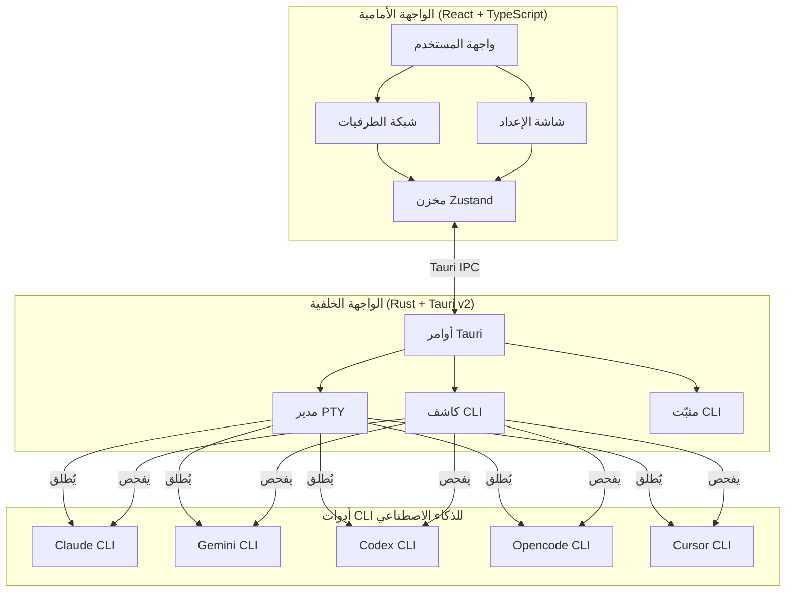
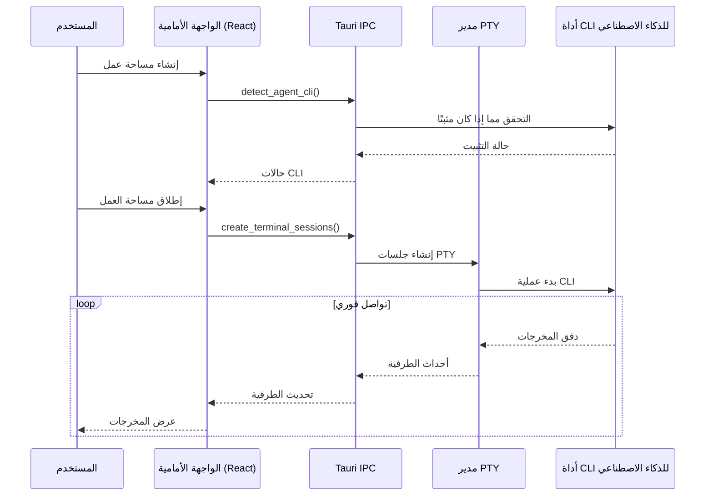

<div align="center">


# YzPzCode

### فريقك البرمجي بالذكاء الاصطناعي، في نافذة واحدة.

**توقف عن التنقل بين 5 نوافذ طرفية مختلفة.** يجمع YzPzCode كلود، جيميناي، كوديكس، أوبنكود، وكيرسر في واجهة نظيفة واحدة.

[](https://github.com/wolfenazz/YzPzCode/stargazers)
[](https://tauri.app)
[](https://react.dev)
[](https://rust-lang.org)
[](LICENSE)

**[تثبيت الآن](#-بداية-سريعة)** · **[شاهد لقطات الشاشة](#-شاهد-التطبيق-في-العمل)** · **[اقرأ التوثيق](docs/userguid.md)**

---

</div>

## لحظة، ما هذا؟

تخيل هذا: أنت تكتب كودًا. تريد من كلود أن يشرح بعض الكود القديم، ومن جيميناي أن تولّد اختبارات، ومن كوديكس أن يساعدك في تلك الخوارزمية المعقدة.

**الطريقة القديمة؟** ثلاث نوافذ طرفية. ثلاثة أدوات CLI مختلفة. تبديل بين النوافذ مثل المجنون. نسخ ولصق بينها. فقدان عقلك.

**طريقة YzPzCode؟** تطبيق واحد. تخطيط شبكي. جميع وكلاء الذكاء الاصطناعي جنبًا إلى جنب، يمكنك مقارنة إجاباتهم.

## شاهد التطبيق في العمل

<div align="center">


*نعم، بهذه النظافة.*

</div>

## لماذا ستحبه

| ما ستحصل عليه | لماذا هو رائع |
|----------------|---------------|
| **شبكة وكلاء متعددين** | كلود على اليسار، جيميناي على اليمين. قارن المخرجات فورًا. اختر الفائز. |
| **إعداد بنقرة واحدة** | لا تعرف ما المثبّت؟ سنكتشف ذلك ونرشدك خلال الباقي. |
| **إعدادات مساحة العمل** | احفظ مجموعات الوكلاء المفضلة لديك. شبكة 3×2 مع كلود + جيميناي؟ نقرة واحدة. |
| **أطرافية حقيقية** | ليست محاكاة — هذه جلسات PTY فعلية مع تفاعل كامل. |
| **عبر المنصات** | ويندوز، ماك أو إس، لينكس. نظامك، خيارك. |
| **خفيف الوزن** | مبني بـ Tauri، وليس Electron. ذاكرتك العشوائية ستشكرك. |

## الوكلاء

ندعم الأقوياء:

<div align="center">

| الوكيل | CLI | القدرة الفائقة |
|--------|-----|----------------|
| **Claude** | `claude` | استدلال عميق، يشرح الكود كمطور أول صبور |
| **Gemini** | `gemini` | سريع، متعدد الوسائط، أفضل ما لدى جوجل |
| **Codex** | `codex` | توليد كود يعمل فعلاً |
| **Opencode** | `opencode` | حرية مفتوحة المصدر |
| **Cursor** | `cursor` | مساعدة ذكاء اصطناعي بمستوى بيئة التطوير |

</div>

## بداية سريعة

**ستحتاج إلى:** Node.js 18+ و Rust (أحدث إصدار مستقر)

```bash
# 1. استنساخ المستودع
git clone https://github.com/wolfenazz/YzPzCode.git
cd YzPzCode/app

# 2. تثبيت التبعيات
npm install

# 3. تشغيل التطبيق
npm run tauri dev
```

تمام. سيكتشف التطبيق أدوات CLI للذكاء الاصطناعي المثبتة لديك ويساعدك في إعداد الباقي.

### مستخدمو macOS

**ثبّت Rust أولاً:**
```bash
curl --proto '=https' --tlsv1.2 -sSf https://sh.rustup.rs | sh
```
ثم أعد تشغيل الطرفية قبل تشغيل `npm run tauri dev`.

**تثبيت من ملف .dmg؟** بما أن التطبيق غير موقع بشهادة مطور Apple، ستظهر رسالة تحذير أمني. إليك كيفية تجاوزها:

**الخيار 1: فتح بنقرة يمين**
1. انقر بزر الماوس الأيمن (أو Control-click) على التطبيق
2. اختر "فتح" ← انقر على "فتح" في النافذة المنبثقة

**الخيار 2: إعدادات النظام**
1. اذهب إلى **إعدادات النظام ← الخصوصية والأمان**
2. انقر على "فتح على أي حال" بجانب رسالة التحذير الأمني

**الخيار 3: الطرفية**
```bash
xattr -cr /Applications/YzPzCode.app
```

التطبيق آمن — مبني من هذا المستودع المفتوح المصدر. التحذير هو مجرد macOS يحميك من التطبيقات غير الموقعة.

> **ملاحظة:** نعمل على توقيع التطبيق بشكل صحيح بشهادة مطور Apple. هذه العملية تستغرق بضعة أسابيع، ولكن بمجرد اكتمالها، لن تظهر رسالة التحذير الأمني بعد الآن.

<details>
<summary>تحتاج تفاصيل أكثر؟</summary>

### المتطلبات الأساسية

- **Node.js** (الإصدار 18+) — [حمّله من هنا](https://nodejs.org)
- **Rust** (أحدث إصدار مستقر) — [احصل عليه من هنا](https://rust-lang.org)
- **pnpm** أو npm — أيهما تفضل

### البناء للإنتاج

```bash
npm run tauri build
```

ينتج هذا مثبّتًا أصليًا لمنصتك. صغير، سريع، بدون حشو.

</details>

## كيف تم بناؤه

اخترنا أدوات لا تُخيب:

**الواجهة الأمامية**
- React 19 + TypeScript
- Vite (لأن الانتظار في البناء شيء عفى عليه الزمن)
- Tailwind CSS v4
- Zustand (إدارة حالة منطقية حقًا)
- xterm.js (تصيير الطرفية)

**الواجهة الخلفية**
- Tauri v2 (مدعوم بـ Rust، خفيف الوزن)
- portable-pty (أطرافية زائفة حقيقية)
- Tokio (غير متزامن يتوسع)

### البنية



### تدفق البيانات



## للفضوليين

```
app/
├── src-tauri/          # الواجهة الخلفية (Rust)
│   └── src/
│       ├── agent/      # تنسيق الوكلاء
│       ├── agent_cli/  # كشف CLI والتثبيت
│       ├── commands/   # معالجات Tauri IPC
│       └── terminal/   # إدارة PTY
├── src/                # الواجهة الأمامية (React)
│   ├── components/     # مكونات واجهة المستخدم
│   ├── hooks/          # خطافات مخصصة
│   ├── stores/         # مخازن Zustand
│   └── types/          # تعريفات TypeScript
└── docs/               # التوثيق
```

## المساهمة

نحب أن نساعدك! إليك كيف تحافظ على عقلك أثناء التطوير:

```bash
# فحص الأنواع
npx tsc --noEmit        # الواجهة الأمامية
cargo check             # الواجهة الخلفية

# التحقق من الأسلوب والتنسيق
cargo clippy            # اكتشاف مشاكل Rust
cargo fmt               # اجعله جميلاً

# الاختبار
cd src-tauri && cargo test
```

وجدت خطأ؟ لديك فكرة؟ [افتح مشكلة](https://github.com/wolfenazz/YzPzCode/issues) أو [أرسل طلب سحب](https://github.com/wolfenazz/YzPzCode/pulls).

اطلع على [خارطة الطريق الكاملة](docs/plane.md).

## الإعداد الموصى به

- [VS Code](https://code.visualstudio.com)
- [إضافة Tauri](https://marketplace.visualstudio.com/items?itemName=tauri-apps.tauri-vscode)
- [rust-analyzer](https://marketplace.visualstudio.com/items?itemName=rust-lang.rust-analyzer)

أو استخدم أي شيء يجعلك منتجًا. لسنا هنا لنحكم.

## الترخيص

MIT. انسخه، ابنِ عليه، اجعله ملكك. فقط تذكر من أين حصلت عليه.

---

<div align="center">

### أعجبك ما تراه؟

إذا أنقذك YzPzCode من فوضى الطرفيات، فكر في إعطائه **نجمة** — هذا يساعد الآخرين في العثور عليه!

[](https://github.com/wolfenazz/YzPzCode/stargazers)

---

**بُني بالكافيين والليالي المتأخرة بواسطة [Naseem](https://github.com/wolfenazz) و Noor و Khalid**

*للمطورين الذين يفضلون البرمجة على إدارة الطرفيات.*

[الإبلاغ عن خطأ](https://github.com/wolfenazz/YzPzCode/issues) · [طلب ميزة](https://github.com/wolfenazz/YzPzCode/issues) · [المساهمة](https://github.com/wolfenazz/YzPzCode/pulls)

</div>
