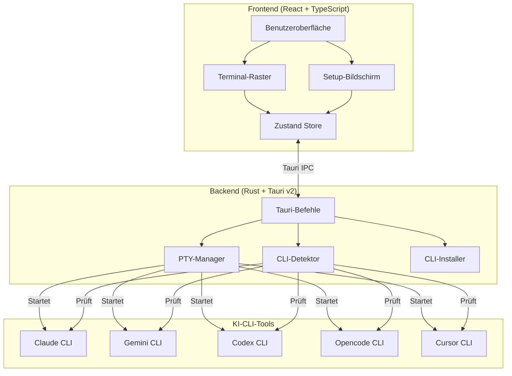
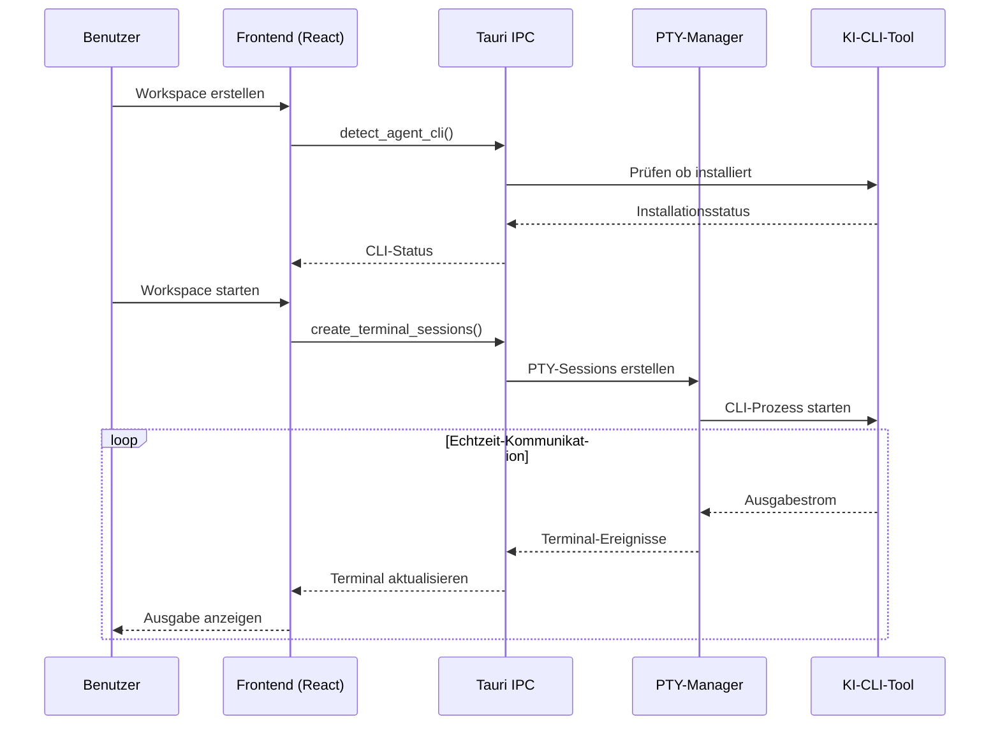

<div align="center">


# YzPzCode

### Dein KI-Coding-Team, nur einen Klick entfernt.

**Hör auf, zwischen 5 verschiedenen Terminals zu jonglieren.** YzPzCode vereint Claude, Gemini, Codex, Opencode und Cursor in einer sauberen Oberfläche.

[](https://github.com/wolfenazz/YzPzCode/stargazers)
[](https://tauri.app)
[](https://react.dev)
[](https://rust-lang.org)
[](LICENSE)

**[Jetzt installieren](#-schnellstart)** · **[Screenshots ansehen](#-die-app-in-aktion-sehen)** · **[Dokumentation lesen](docs/userguid.md)**

---

</div>

## Moment mal, was ist das hier?

Stell dir das vor: Du programmierst. Du möchtest, dass Claude dir alten Code erklärt, Gemini Tests generiert und Codex dir bei diesem kniffligen Algorithmus hilft.

**Der alte Weg?** Drei Terminalfenster. Drei verschiedene CLIs. Wie verrückt zwischen den Fenstern wechseln. Hin- und herkopieren. Den Verstand verlieren.

**Der YzPzCode-Weg?** Eine App. Raster-Layout. Alle deine KI-Agenten nebeneinander, und du kannst ihre Antworten vergleichen.

## Die App in Aktion sehen

<div align="center">


*Ja, so sauber ist das.*

</div>

## Warum du es lieben wirst

| Was du bekommst | Warum es genial ist |
|-----------------|---------------------|
| **Multi-Agenten-Raster** | Claude links, Gemini rechts. Vergleiche Ergebnisse sofort. Wähle den Gewinner. |
| **Ein-Klick-Setup** | Du weißt nicht, was installiert ist? Wir finden es heraus und leiten dich durch den Rest. |
| **Workspace-Voreinstellungen** | Speichere deine liebsten Agenten-Kombos. 3x2-Raster mit Claude + Gemini? Ein Klick. |
| **Echte Terminals** | Keine Simulation — das sind echte PTY-Sessions mit voller Interaktivität. |
| **Plattformübergreifend** | Windows, macOS, Linux. Dein OS, deine Wahl. |
| **Leichtgewichtig** | Gebaut mit Tauri, nicht Electron. Dein RAM wird es dir danken. |

## Die Agenten

Wir unterstützen die Schwergewichte:

<div align="center">

| Agent | CLI | Superkraft |
|-------|-----|------------|
| **Claude** | `claude` | Tiefes Denken, erklärt Code wie ein geduldiger Senior-Entwickler |
| **Gemini** | `gemini` | Schnell, multimodal, das Beste von Google |
| **Codex** | `codex` | Code-Generierung, die wirklich funktioniert |
| **Opencode** | `opencode` | Open-Source-Freiheit |
| **Cursor** | `cursor` | KI-Assistenz auf IDE-Niveau |

</div>

## Schnellstart

**Du brauchst:** Node.js 18+ und Rust (neueste stabile Version)

```bash
# 1. Klonen
git clone https://github.com/wolfenazz/YzPzCode.git
cd YzPzCode/app

# 2. Abhängigkeiten installieren
npm install

# 3. Starten
npm run tauri dev
```

Fertig. Die App erkennt, welche KI-CLIs du installiert hast, und hilft dir, den Rest einzurichten.

### macOS-Benutzer

**Installiere zuerst Rust:**
```bash
curl --proto '=https' --tlsv1.2 -sSf https://sh.rustup.rs | sh
```
Dann starte dein Terminal neu, bevor du `npm run tauri dev` ausführst.

**Installation von .dmg?** Da die App nicht mit einem Apple-Entwicklerzertifikat signiert ist, siehst du eine Sicherheitswarnung. So umgehst du sie:

**Option 1: Rechtsklick öffnen**
1. Rechtsklicke (oder Steuerungsklick) auf die App
2. Wähle „Öffnen" → Klicke auf „Öffnen" im Dialog

**Option 2: Systemeinstellungen**
1. Gehe zu **Systemeinstellungen → Datenschutz & Sicherheit**
2. Klicke auf „Trotzdem öffnen" neben der Sicherheitswarnung

**Option 3: Terminal**
```bash
xattr -cr /Applications/YzPzCode.app
```

Die App ist sicher — sie wurde aus diesem Open-Source-Repository gebaut. Die Warnung ist nur macOS, das dich vor unsignierten Apps schützt.

> **Hinweis:** Wir arbeiten daran, die App ordnungsgemäß mit einem Apple-Entwicklerzertifikat zu signieren. Dieser Prozess dauert einige Wochen, aber sobald er abgeschlossen ist, wird die Sicherheitswarnung nicht mehr erscheinen.

<details>
<summary>Mehr Details benötigt?</summary>

### Voraussetzungen

- **Node.js** (v18+) — [Hier herunterladen](https://nodejs.org)
- **Rust** (neueste stabile Version) — [Hier erhalten](https://rust-lang.org)
- **pnpm** oder npm — whichever du bevorzugst

### Build für die Produktion

```bash
npm run tauri build
```

Das erzeugt einen nativen Installer für deine Plattform. Klein, schnell, kein Ballast.

</details>

## Wie es gebaut wurde

Wir haben Tools gewählt, die gut sind:

**Frontend**
- React 19 + TypeScript
- Vite (weil Warten auf Builds so 2020 ist)
- Tailwind CSS v4
- Zustand (State-Management, das Sinn ergibt)
- xterm.js (Terminal-Rendering)

**Backend**
- Tauri v2 (Rust-betrieben, leichtgewichtig)
- portable-pty (echte Pseudo-Terminals)
- Tokio (Async, das skaliert)

### Architektur



### Datenfluss



## Für Neugierige

```
app/
├── src-tauri/          # Rust-Backend
│   └── src/
│       ├── agent/      # Agenten-Orchestrierung
│       ├── agent_cli/  # CLI-Erkennung & Installation
│       ├── commands/   # Tauri-IPC-Handler
│       └── terminal/   # PTY-Verwaltung
├── src/                # React-Frontend
│   ├── components/     # UI-Komponenten
│   ├── hooks/          # Eigene Hooks
│   ├── stores/         # Zustand-Stores
│   └── types/          # TypeScript-Definitionen
└── docs/               # Dokumentation
```

## Mitwirken

Wir freuen uns über deine Hilfe! So bleibst du bei der Entwicklung vernünftig:

```bash
# Typ-Prüfung
npx tsc --noEmit        # Frontend
cargo check             # Backend

# Linting & Formatierung
cargo clippy            # Rust-Probleme finden
cargo fmt               # Es hübsch machen

# Tests
cd src-tauri && cargo test
```

Einen Bug gefunden? Eine Idee? [Eröffne ein Issue](https://github.com/wolfenazz/YzPzCode/issues) oder [reiche einen PR ein](https://github.com/wolfenazz/YzPzCode/pulls).

Sieh dir die [vollständige Roadmap](docs/plane.md) an.

## Empfohlene Einrichtung

- [VS Code](https://code.visualstudio.com)
- [Tauri-Erweiterung](https://marketplace.visualstudio.com/items?itemName=tauri-apps.tauri-vscode)
- [rust-analyzer](https://marketplace.visualstudio.com/items?itemName=rust-lang.rust-analyzer)

Oder verwende, was dich produktiv macht. Wir urteilen nicht.

## Lizenz

MIT. Fork es, baue darauf, mach es zu deinem. Denk nur daran, woher du es hast.

---

<div align="center">

### Gefällt dir, was du siehst?

Wenn YzPzCode dich vor dem Terminal-Chaos gerettet hat, gib ihm einen **Stern** — das hilft anderen, es zu finden!

[](https://github.com/wolfenazz/YzPzCode/stargazers)

---

**Gebaut mit Koffein und späten Nächten von [Naseem](https://github.com/wolfenazz), Noor & Khalid**

*Für Entwickler, die lieber programmieren als Terminals verwalten.*

[Bug melden](https://github.com/wolfenazz/YzPzCode/issues) · [Feature anfragen](https://github.com/wolfenazz/YzPzCode/issues) · [Beitragen](https://github.com/wolfenazz/YzPzCode/pulls)

</div>
