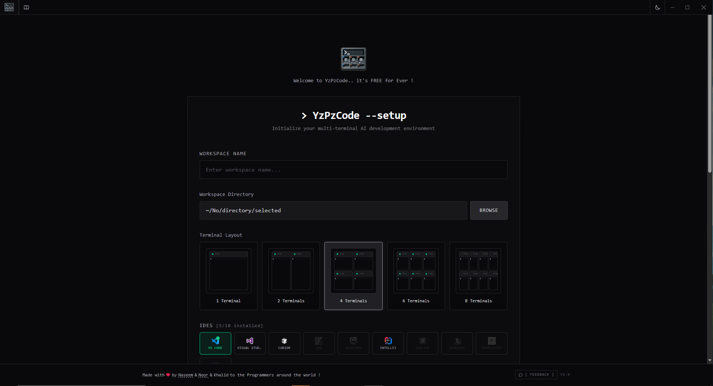
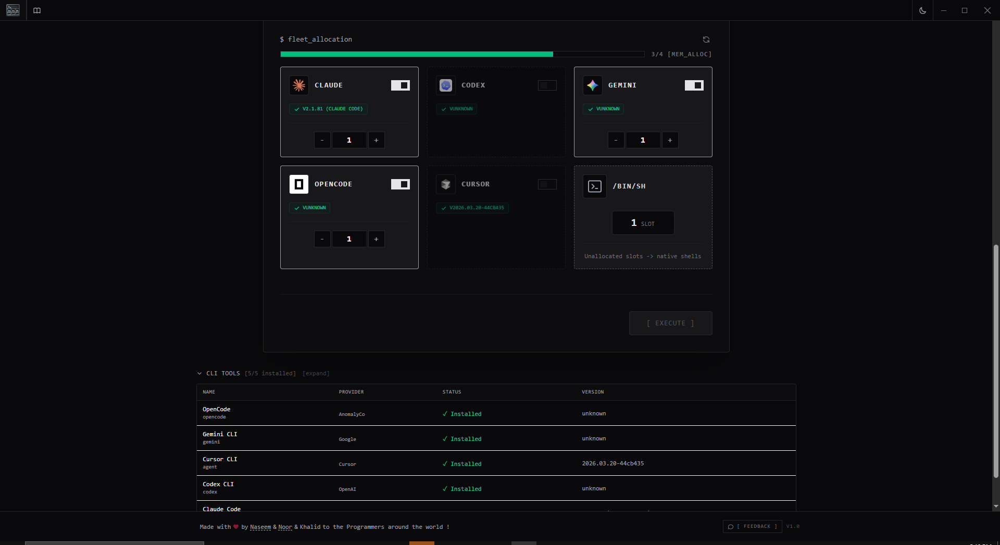
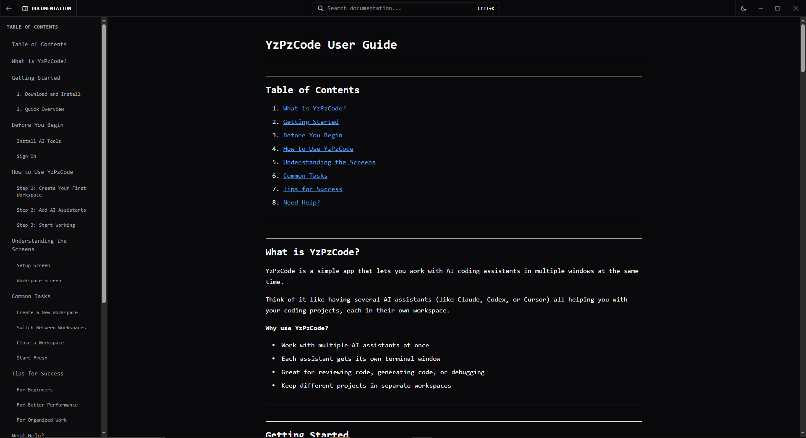
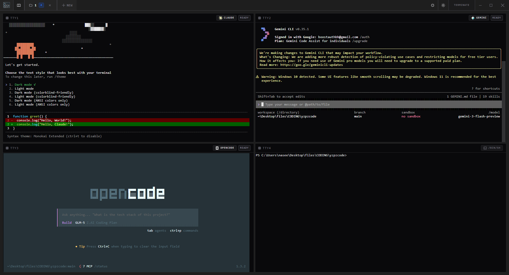

<h1>YzPzCode</h1>

<strong>Tu equipo de programación con IA, a una sola ventana.</strong>

<i>Deja de lidiar con 5 terminales diferentes. YzPzCode reúne a Claude, Gemini, Codex, Opencode, Cursor, Kilo, Hermes y Pi en una sola interfaz limpia — además de 10 CLIs de herramientas SaaS, un navegador integrado con inspector de diseño visual, un diseñador impulsado por IA, y un editor de imágenes integrado estilo Photoshop — más un agente de programación con IA integrado (YZPZ Agent), ejecutándose en un harness de agente local.</i>

&nbsp;

&nbsp;

 

---

<i>Nota: Esta app está en desarrollo, y es posible que algunas funciones no funcionen del todo bien. Seguimos actualizando la app cada vez más. En el futuro, todo funcionará por completo.</i>

- El problema

| [¡] La forma antigua | [+] La forma YzPzCode |
|:--------------:|:-------------------:|
| Tres ventanas de terminal | **Una sola app** |
| Tres CLIs diferentes | **Los 8 agentes de IA integrados** |
| Alt-tab como un loco | **Cuadrícula lado a lado** |
| Navegador aparte para devtools | **Navegador integrado con inspector** |
| Copiar y pegar entre ellas | **Compara al instante** |
| Perdiendo la cabeza | **Mantente en el flujo** |

---

## - Ver la app en acción

  

  
<i>Limpio. Rápido. Potente.</i>

 

<i>Mira YzPzCode en acción - Demo en video</i>

---

## Capacidades principales

<table>
<tr>
<td><b>Cuadrícula multi-agente</b> Ejecuta Claude, Gemini, Codex, Kilo, Pi y más en vistas sincronizadas, lado a lado.</td>
<td><b>Inicialización automática</b> Detecta y configura al instante los CLIs instalados localmente.</td>
<td><b>Preajustes de espacio de trabajo</b> Guarda y restaura combinaciones óptimas de agentes para flujos de trabajo específicos.</td>
<td><b>Terminales nativas</b> Impulsadas por sesiones PTY reales para una interacción CLI auténtica.</td>
</tr>
<tr>
<td><b>Soporte multiplataforma</b> Binarios optimizados para Windows, macOS y Linux.</td>
<td><b>Eficiencia de recursos</b> Construido con Tauri y Rust, utilizando una fracción de la RAM que requiere Electron.</td>
<td><b>Explorador integrado</b> Gestiona archivos y directorios sin salir de la aplicación.</td>
<td><b>Integración con Git</b> Supervisa el estado del repositorio y las estadísticas de diff de un vistazo.</td>
</tr>
<tr>
<td><b>Editor Monaco</b> Editor multitab integrado basado en Monaco con resaltado de sintaxis, buscar/reemplazar y vistas previas de archivos enriquecidas (PDF, DOCX, XLSX, PPTX, DrawIO, imágenes).</td>
<td><b>Integración con IDE</b> Lanza sin fricciones a más de 10 entornos de desarrollo compatibles.</td>
<td><b>Seguimiento de autenticación</b> Supervisa el estado de las credenciales en todas las herramientas CLI activas.</td>
<td><b>Entrega continua</b> Los mecanismos de actualización automatizados garantizan el acceso a las últimas funciones.</td>
</tr>
<tr>
<td><b>Navegador integrado</b> Navegador basado en webview con pestañas, zoom, preajustes de dispositivo y exportación de capturas.</td>
<td><b>Inspector de diseño visual</b> Inspecciona, captura y aplica estilos de cualquier página web.</td>
<td><b>Diseñador de IA</b> Generación de diseños de interfaz a partir de prompts, con vista previa en vivo y exportación de código.</td>
<td><b>Discord Rich Presence</b> Muestra tu espacio de trabajo y tu actividad en tu perfil de Discord.</td>
</tr>
<tr>
<td><b>Gestión de CLIs de herramientas</b> Detecta, instala y verifica la autenticación de 10 CLIs SaaS (GitHub, Stripe, Supabase, Vercel y más).</td>
<td><b>Multi-espacio de trabajo</b> Varios espacios de trabajo abiertos con cambio de pestañas y estado por espacio de trabajo.</td>
<td><b>Comandos gestionados</b> Ejecuta comandos no interactivos con seguimiento de estado y monitoreo de PID.</td>
<td><b>Personalización de la interfaz</b> 8 colores de acento, 3 niveles de densidad, cursor personalizado y activación/desactivación de animaciones.</td>
</tr>
<tr>
<td><b>YZPZ Agent</b> Agente de programación con IA integrado (harness de agente local) con chat en streaming, registros de herramientas e historial de sesiones.</td>
<td><b>Equipos de agentes y aprobaciones</b> Orquesta subagentes, aprueba solicitudes de herramientas y haz seguimiento de tareas en tiempo real.</td>
<td><b>Editor de prompts enriquecido</b> Barra de formato más menciones de archivos con `@` que se resuelven a rutas del espacio de trabajo.</td>
<td><b>Prompts rápidos del inspector</b> Prompts predefinidos de un clic (Mejorar / Ajustar) para el inspector de elementos, totalmente personalizables.</td>
</tr>
<tr>
<td><b>Editor de imágenes</b> Editor integrado estilo Photoshop con sistema de capas, pintura, selecciones e historial de deshacer.</td>
<td><b>Sistema de capas</b> Capas raster, de imagen, de texto y de formas con opacidad, bloqueo y 16 modos de fusión.</td>
<td><b>Conjunto completo de herramientas</b> Herramientas de mover, marco, lazo, recortar, pincel, borrador, relleno, texto, formas, cuentagotas, zoom y mano.</td>
<td><b>Vista de imágenes</b> Abre archivos PNG, JPG, WebP, SVG, GIF, BMP, AVIF y TIFF directamente en el espacio de trabajo.</td>
</tr>
</table>

---
## - CLIs de agentes de IA

<table>
<tr>
<td align="center" width="120">

  <b>Claude</b> <code>claude</code> Razonamiento profundo, explicaciones pacientes
</td>
<td align="center" width="120">

  <b>Gemini</b> <code>gemini</code> Rápido, multimodal, lo mejor de Google
</td>
<td align="center" width="120">

  <b>Codex</b> <code>codex</code> Generación de código que funciona
</td>
<td align="center" width="120">

  <b>Opencode</b> <code>opencode</code> Libertad de código abierto
</td>
<td align="center" width="120">

  <b>Cursor</b> <code>cursor</code> Asistencia de IA a nivel de IDE
</td>
<td align="center" width="120">

  <b>Kilo</b> <code>kilo</code> Agente de código para cualquier tarea
</td>
<td align="center" width="120">

  <b>Hermes</b> <code>hermes</code> Agente de código rápido y eficiente
</td>
<td align="center" width="120">

  <b>Pi</b> <code>pi</code> Entorno de código para terminal minimalista
</td>
</tr>
</table>

---

## - CLIs de herramientas SaaS

YzPzCode también gestiona y verifica la autenticación de estos 10 CLIs de herramientas:

<table>
<tr>
<td align="center" width="100"><b>GitHub</b> <code>gh</code></td>
<td align="center" width="100"><b>Stripe</b> <code>stripe</code></td>
<td align="center" width="100"><b>Supabase</b> <code>supabase</code></td>
<td align="center" width="100"><b>Valyu</b> <code>valyu-cli</code></td>
<td align="center" width="100"><b>PostHog</b> <code>posthog-cli</code></td>
</tr>
<tr>
<td align="center"><b>ElevenLabs</b> <code>elevenlabs</code></td>
<td align="center"><b>Ramp</b> <code>ramp</code></td>
<td align="center"><b>GWS</b> <code>gws</code></td>
<td align="center"><b>AgentMail</b> <code>agentmail-cli</code></td>
<td align="center"><b>Vercel</b> <code>vercel</code></td>
</tr>
</table>

---
## - Navegador integrado y herramientas de diseño visual

Integrado directamente en el espacio de trabajo — no más cambiar de ventana para el desarrollo web:

- **Navegador multitab**: Navega y previsualiza tus apps en un panel webview
- **Preajustes de dispositivo**: Responsive, iPhone 14 Pro, iPad — cambia la orientación
- **Controles de zoom**: Ajusta el zoom del 50% al 200%
- **Exportación de capturas**: Captura el HTML completo de la página
- **Modo ventana emergente**: Arrastra el navegador a su propia ventana

### Inspector de diseño visual
- **Modo inspección**: Pasa el cursor sobre cualquier elemento para ver su estructura HTML, selectores y atributos
- **Modo capturar estilo**: Haz clic para capturar los estilos CSS calculados (con pseudo-elementos) al portapapeles
- **Modo capturar elemento de UI**: Captura en profundidad un componente de UI completo — árbol de estructura (hasta 8 niveles), cuadrícula de layout, espaciado, tipografía, colores, modelo de caja, recursos y un análisis de intención de diseño generado automáticamente
- **Modo aplicar**: Aplica los estilos capturados a los elementos objetivo con soporte de deshacer y generación de clases CSS
- **Prompts rápidos**: Chips de prompts predefinidos de un clic (grupos Mejorar / Ajustar) que rellenan el editor de instrucciones, totalmente personalizables y restablecibles desde Configuración → Prompts rápidos

---

## - Diseñador de IA

Genera diseños de interfaz completos a partir de prompts en lenguaje natural:

- **Generación basada en prompts**: Describe lo que quieres y obtén un diseño completo
- **Múltiples temas**: Elige entre temas de diseño curados
- **Tipos de página**: Páginas de aterrizaje, paneles de control y más
- **Vista previa en vivo**: Ve los diseños en marcos de dispositivo responsive
- **Panel de personalización**: Ajusta colores, fuentes y espaciado
- **Inspector de elementos**: Inspecciona las propiedades de los componentes generados
- **Exportación de código**: Exporta el código HTML/CSS/JS generado
- **Historial de diseños**: Explora y restaura iteraciones de diseño anteriores
- **Gestión de skills**: Gestiona habilidades de ingeniería de prompts para obtener mejores resultados

---
## - YZPZ Agent (agente de IA integrado)

YzPzCode ahora incluye su propio agente de programación con IA — no se requiere ningún CLI externo:

- **Vista de agente**: Una vista dedicada del espacio de trabajo para sesiones de programación basadas en chat, junto a las vistas de terminal, editor y navegador
- **Harness de agente local**: Un harness sidecar de Node.js (incluido con la app, iniciado y supervisado automáticamente por el host de Rust) ejecuta el motor del agente
- **Chat en streaming**: Transmisión de mensajes en tiempo real con renderizado enriquecido de texto, llamadas a herramientas, resultados e imágenes
- **Registros de ejecución de herramientas**: Observa cada llamada a herramienta mientras se ejecuta — estado, entrada y resultados en un registro en vivo
- **Aprobaciones y permisos**: Aprueba o rechaza de forma interactiva las solicitudes de herramientas antes de que se ejecuten
- **Tareas y subagentes**: Listas de tareas en vivo y seguimiento de la actividad de los subagentes, además de **equipos de agentes** que orquestan varios subagentes en una tarea
- **Selección de proveedor y modelo**: Elige cualquier proveedor/modelo compatible (con claves de API y URLs base personalizadas opcionales) y establece un prompt de sistema personalizado
- **Historial de sesiones y reanudación**: Las sesiones están limitadas a cada espacio de trabajo — explora el historial y reanuda en cualquier momento
- **Estrategias de compactación**: Controla la compactación del contexto para mantener eficientes las sesiones de larga duración
- **Indicadores de uso y contexto**: Haz seguimiento del uso de tokens y del presupuesto de contexto en tiempo real mientras trabajas
- **Editor de prompts enriquecido**: Formatea los prompts (negrita, cursiva, código, citas, listas, enlaces) y escribe `@` para buscar con coincidencia difusa y adjuntar archivos del espacio de trabajo
- **Comandos slash por agente**: Una referencia integrada de los `/commands` disponibles para cada CLI de agente compatible

---
<!--CHUNK-END-->
