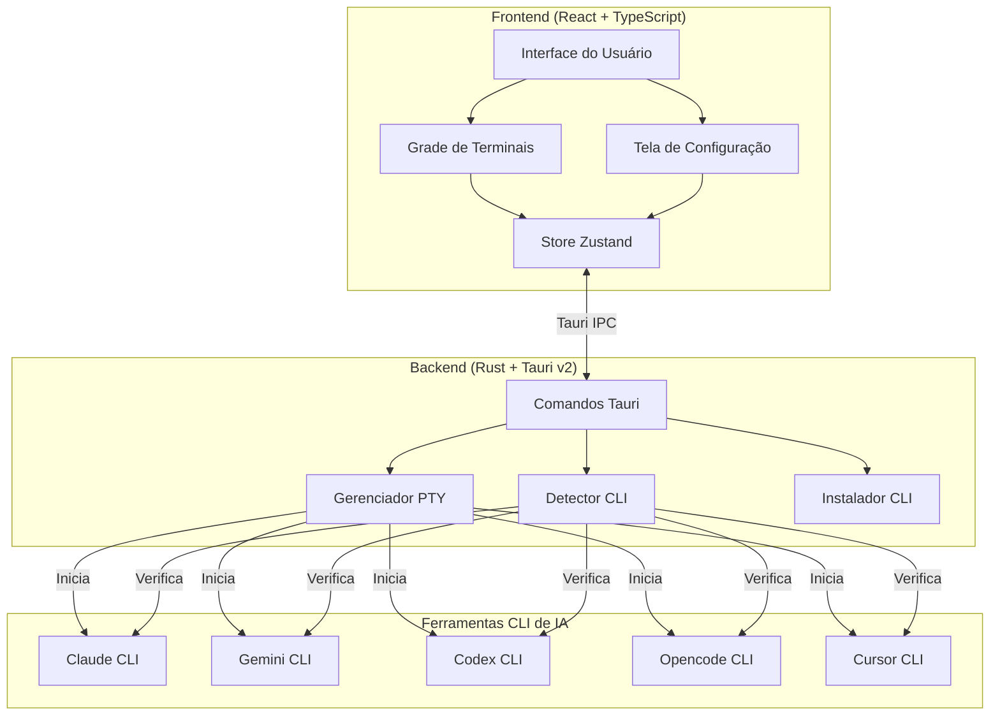
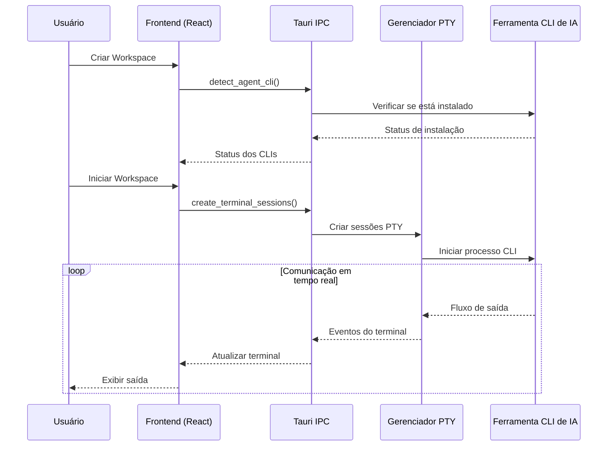

<div align="center">


# YzPzCode

### Sua equipe de programação com IA, a uma janela de distância.

**Pare de ficar alternando entre 5 terminais diferentes.** O YzPzCode reúne Claude, Gemini, Codex, Opencode e Cursor em uma interface limpa e unificada.

[](https://github.com/wolfenazz/YzPzCode/stargazers)
[](https://tauri.app)
[](https://react.dev)
[](https://rust-lang.org)
[](LICENSE)

**[Instalar agora](#-início-rápido)** · **[Ver capturas de tela](#-veja-a-app-em-ação)** · **[Ler a documentação](docs/userguid.md)**

---

</div>

## Espera, o que é isso?

Imagine isso: você está programando. Quer que o Claude explique um código legado, que o Gemini gere testes e que o Codex ajude com aquele algoritmo complicado.

**O jeito antigo?** Três janelas de terminal. Três CLIs diferentes. Alt-tabando como um louco. Copiando e colando entre eles. Perdendo a cabeça.

**O jeito YzPzCode?** Um app só. Layout em grade. Todos os seus agentes de IA lado a lado, e você pode comparar as respostas deles.

## Veja a app em ação

<div align="center">


*É, é tão limpo assim.*

</div>

## Por que você vai amar

| O que você ganha | Por que é incrível |
|-------------------|--------------------|
| **Grade multi-agente** | Claude à esquerda, Gemini à direita. Compare saídas instantaneamente. Escolha o vencedor. |
| **Configuração com um clique** | Não sabe o que está instalado? Nós descobrimos e te guiamos pelo resto. |
| **Predefinições de workspace** | Salve suas combinações favoritas de agentes. Grade 3x2 com Claude + Gemini? Um clique. |
| **Terminais reais** | Não é uma simulação — são sessões PTY reais com interatividade completa. |
| **Multiplataforma** | Windows, macOS, Linux. Seu SO, sua escolha. |
| **Leve** | Construído com Tauri, não Electron. Sua RAM vai agradecer. |

## Os Agentes

Damos suporte aos pesos pesados:

<div align="center">

| Agente | CLI | Superpoder |
|--------|-----|------------|
| **Claude** | `claude` | Raciocínio profundo, explica código como um dev sênior paciente |
| **Gemini** | `gemini` | Rápido, multimodal, o melhor do Google |
| **Codex** | `codex` | Geração de código que realmente funciona |
| **Opencode** | `opencode` | Liberdade de código aberto |
| **Cursor** | `cursor` | Assistência de IA em nível de IDE |

</div>

## Início rápido

**Você vai precisar de:** Node.js 18+ e Rust (última versão estável)

```bash
# 1. Clone o repositório
git clone https://github.com/wolfenazz/YzPzCode.git
cd YzPzCode/app

# 2. Instale as dependências
npm install

# 3. Execute
npm run tauri dev
```

Pronto. O app detectará quais CLIs de IA você tem instalados e ajudará a configurar o resto.

### Usuários de macOS

**Instale o Rust primeiro:**
```bash
curl --proto '=https' --tlsv1.2 -sSf https://sh.rustup.rs | sh
```
Depois reinicie seu terminal antes de executar `npm run tauri dev`.

**Instalando a partir de um .dmg?** Como o app não está assinado com um certificado de desenvolvedor Apple, você verá um aviso de segurança. Veja como contornar:

**Opção 1: Abrir com clique direito**
1. Clique com o botão direito (ou Control-clique) no app
2. Selecione "Abrir" → Clique em "Abrir" no diálogo

**Opção 2: Configurações do Sistema**
1. Vá para **Configurações do Sistema → Privacidade e Segurança**
2. Clique em "Abrir assim mesmo" ao lado do aviso de segurança

**Opção 3: Terminal**
```bash
xattr -cr /Applications/YzPzCode.app
```

O app é seguro — foi construído a partir deste repositório de código aberto. O aviso é apenas o macOS protegendo você de apps não assinadas.

> **Nota:** Estamos trabalhando para assinar o app corretamente com um certificado de desenvolvedor Apple. Esse processo leva algumas semanas, mas uma vez concluído, o aviso de segurança não aparecerá mais.

<details>
<summary>Precisa de mais detalhes?</summary>

### Pré-requisitos

- **Node.js** (v18+) — [Baixe aqui](https://nodejs.org)
- **Rust** (última versão estável) — [Obtenha aqui](https://rust-lang.org)
- **pnpm** ou npm — o que você preferir

### Build para produção

```bash
npm run tauri build
```

Isso gera um instalador nativo para sua plataforma. Pequeno, rápido, sem inchaço.

</details>

## Como foi construído

Escolhemos ferramentas que funcionam:

**Frontend**
- React 19 + TypeScript
- Vite (porque esperar builds é coisa de 2020)
- Tailwind CSS v4
- Zustand (gerenciamento de estado que faz sentido)
- xterm.js (renderização de terminal)

**Backend**
- Tauri v2 (potenciado por Rust, leve)
- portable-pty (pseudo-terminais reais)
- Tokio (async que escala)

### Arquitetura



### Fluxo de dados



## Para os curiosos

```
app/
├── src-tauri/          # Backend em Rust
│   └── src/
│       ├── agent/      # Orquestração de agentes
│       ├── agent_cli/  # Detecção e instalação de CLI
│       ├── commands/   # Manipuladores Tauri IPC
│       └── terminal/   # Gerenciamento de PTY
├── src/                # Frontend em React
│   ├── components/     # Componentes de UI
│   ├── hooks/          # Hooks personalizados
│   ├── stores/         # Stores Zustand
│   └── types/          # Definições TypeScript
└── docs/               # Documentação
```

## Contribuindo

Adoraríamos sua ajuda! Veja como não enlouquecer durante o desenvolvimento:

```bash
# Verificação de tipos
npx tsc --noEmit        # Frontend
cargo check             # Backend

# Linting e formatação
cargo clippy            # Encontrar problemas no Rust
cargo fmt               # Deixar bonito

# Testes
cd src-tauri && cargo test
```

Encontrou um bug? Tem uma ideia? [Abra uma issue](https://github.com/wolfenazz/YzPzCode/issues) ou [envie um PR](https://github.com/wolfenazz/YzPzCode/pulls).

Confira o [roadmap completo](docs/plane.md).

## Configuração recomendada

- [VS Code](https://code.visualstudio.com)
- [Extensão do Tauri](https://marketplace.visualstudio.com/items?itemName=tauri-apps.tauri-vscode)
- [rust-analyzer](https://marketplace.visualstudio.com/items?itemName=rust-lang.rust-analyzer)

Ou use o que te torna produtivo. Não estamos aqui para julgar.

## Licença

MIT. Faça fork, construa em cima, torne seu. Só lembre de onde você conseguiu.

---

<div align="center">

### Gostou do que viu?

Se o YzPzCode te salvou do caos dos terminais, considere dar uma **estrela** — isso ajuda outros a encontrá-lo!

[](https://github.com/wolfenazz/YzPzCode/stargazers)

---

**Construído com cafeína e noites em claro por [Naseem](https://github.com/wolfenazz), Noor & Khalid**

*Para desenvolvedores que preferem programar a gerenciar terminais.*

[Reportar um bug](https://github.com/wolfenazz/YzPzCode/issues) · [Solicitar um recurso](https://github.com/wolfenazz/YzPzCode/issues) · [Contribuir](https://github.com/wolfenazz/YzPzCode/pulls)

</div>
