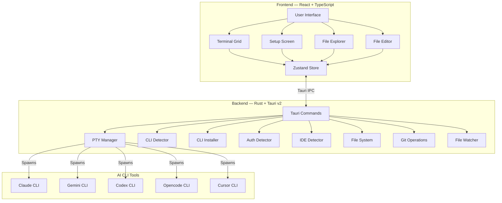

<div align="center">


<h1>YzPzCode</h1>

<p><strong>Your AI Coding Squad, One Window Away.</strong></p>

<p><i>Stop juggling 5 different terminals.<br>YzPzCode brings Claude, Gemini, Codex, Opencode, and Cursor together in one clean interface.</i></p>

[](https://github.com/wolfenazz/YzPzCode/stargazers)
[](https://tauri.app)
[](https://react.dev)
[](https://rust-lang.org)
[](LICENSE)

<p>
<a href="https://github.com/wolfenazz/YzPzCode/releases">
  
</a>
&nbsp;
<a href="#-see-it-in-action">
  
</a>
&nbsp;
<a href="docs/userguid.md">
  
</a>
</p>

<br>

</div>

---
<p><i>Note: This app is under development, and maybe some features do not work, probably. We are keeping updating the app more and more. In the future everything will be work Fully</i></p>
## - The Problem

<div align="center">

| [!] The Old Way | [+] The YzPzCode Way |
|:--------------:|:-------------------:|
| Three terminal windows | **One app** |
| Three different CLIs | **All agents inside** |
| Alt-tabbing like a maniac | **Side-by-side grid** |
| Copy-pasting between them | **Compare instantly** |
| Losing your mind | **Stay in flow** |

</div>

---

## - See It In Action

<div align="center">


<br><br>


<br><br>
<i>Clean. Fast. Powerful.</i>

</div>

---

## Core Capabilities

<table>
<tr>
<td><b>Multi-Agent Grid</b><br><sub>Run Claude, Gemini, and Codex in synchronized, side-by-side views.</sub></td>
<td><b>Automated Initialization</b><br><sub>Instantly detect and configure locally installed CLIs.</sub></td>
<td><b>Workspace Presets</b><br><sub>Save and restore optimal agent combinations for specific workflows.</sub></td>
<td><b>Native Terminals</b><br><sub>Powered by actual PTY sessions for authentic CLI interaction.</sub></td>
</tr>
<tr>
<td><b>Cross-Platform Support</b><br><sub>Optimized binaries for Windows, macOS, and Linux.</sub></td>
<td><b>Resource Efficient</b><br><sub>Built on Tauri and Rust, utilizing a fraction of the RAM required by Electron.</sub></td>
<td><b>Integrated Explorer</b><br><sub>Manage files and directories without leaving the application.</sub></td>
<td><b>Git Integration</b><br><sub>Monitor repository status and diff statistics at a glance.</sub></td>
</tr>
<tr>
<td><b>Multi-Tab Editor</b><br><sub>Built-in syntax highlighting and file preview capabilities.</sub></td>
<td><b>IDE Integration</b><br><sub>Seamlessly launch into over 10 supported development environments.</sub></td>
<td><b>Authentication Tracking</b><br><sub>Monitor credential states across all active CLI tools.</sub></td>
<td><b>Continuous Delivery</b><br><sub>Automated update mechanisms ensure access to the latest features.</sub></td>
</tr>
</table>

---

## - AI Agent CLIs

<div align="center">

<table>
<tr>
<td align="center" width="140">

<br><br><b>Claude</b><br><code>claude</code><br><sub>Deep reasoning, patient explanations</sub>
</td>
<td align="center" width="140">

<br><br><b>Gemini</b><br><code>gemini</code><br><sub>Fast, multimodal, Google's finest</sub>
</td>
<td align="center" width="140">

<br><br><b>Codex</b><br><code>codex</code><br><sub>Code generation that works</sub>
</td>
<td align="center" width="140">

<br><br><b>Opencode</b><br><code>opencode</code><br><sub>Open-source freedom</sub>
</td>
<td align="center" width="140">

<br><br><b>Cursor</b><br><code>cursor</code><br><sub>IDE-level AI assistance</sub>
</td>
</tr>
</table>

</div>

---

## Supported Development Environments

<div align="center">

<table>
<tr>
<td align="center" width="100">
<br><sub>VS Code</sub>
</td>
<td align="center" width="100">
<br><sub>Cursor</sub>
</td>
<td align="center" width="100">
<br><sub>Zed</sub>
</td>
<td align="center" width="100">
<br><sub>Visual Studio</sub>
</td>
<td align="center" width="100">
<br><sub>WebStorm</sub>
</td>
</tr>
<tr>
<td align="center">
<br><sub>IntelliJ</sub>
</td>
<td align="center">
<br><sub>Sublime Text</sub>
</td>
<td align="center">
<br><sub>Windsurf</sub>
</td>
<td align="center">
<br><sub>Perplexity</sub>
</td>
<td align="center">
<br><sub>Antigravity</sub>
</td>
</tr>
</table>

</div>

---

## - Quick Start

> **You'll need:** Node.js 18+ and Rust (latest stable)

```bash
# 1. Clone it
git clone https://github.com/wolfenazz/YzPzCode.git
cd YzPzCode/app

# 2. Install dependencies
npm install

# 3. Run it
npm run tauri dev
```

The app will detect what AI CLIs you have installed and help you set up the rest.

<details>
<summary><b>- macOS Users</b></summary>

<br>

**Install Rust first:**
```bash
curl --proto '=https' --tlsv1.2 -sSf https://sh.rustup.rs | sh
```
Then restart your terminal before running `npm run tauri dev`.

**Installing from .dmg?** Since the app isn't code-signed yet:

| Option | How |
|--------|-----|
| **Right-click** | Right-click the app → Open → Click Open |
| **System Settings** | System Settings → Privacy & Security → Open Anyway |
| **Terminal** | `xattr -cr /Applications/YzPzCode.app` |

> **Note:** We're working on getting the app properly code-signed with Apple Developer and Microsoft certificates.

</details>

<details>
<summary><b>- Build for Production</b></summary>

<br>

```bash
npm run tauri build
```

Generates a native installer for your platform. Small, fast, no bloat.

</details>

---

## - How It's Built

<div align="center">

| Layer | Stack |
|:-----:|-------|
| **Frontend** | React 19 + TypeScript · Vite · Tailwind CSS v4 · Zustand · xterm.js |
| **Backend** | Tauri v2 (Rust) · portable-pty · Tokio |

</div>

### Architecture



---

## - Project Structure

```
app/
├── src-tauri/                      # Rust backend
│   └── src/
│       ├── agent/                  # Agent task execution & orchestration
│       ├── agent_cli/              # CLI detection, installation & launching
│       │   └── providers/          # Provider-specific implementations
│       ├── commands/               # Tauri IPC handlers
│       ├── terminal/               # PTY session management
│       ├── filesystem/             # File operations, git, watcher
│       ├── ide/                    # IDE detection & launching
│       └── utils/                  # Utilities
├── src/                            # React frontend
│   ├── components/
│   │   ├── setup/                  # Setup & configuration screens
│   │   ├── workspace/              # Terminal grid & sessions
│   │   ├── explorer/               # File explorer & git panels
│   │   ├── editor/                 # Multi-tab file editor
│   │   ├── common/                 # Shared components
│   │   └── feedback/               # Feedback modal
│   ├── hooks/                      # Custom React hooks
│   ├── stores/                     # Zustand state management
│   └── types/                      # TypeScript definitions
└── docs/                           # Documentation
```

---

## - Contributing

```bash
# Type checking
npx tsc --noEmit          # Frontend
cargo check               # Backend

# Linting & formatting
cargo clippy              # Catch Rust issues
cargo fmt                 # Make it pretty

# Testing
cd src-tauri && cargo test
```

Found a bug? Have an idea? [Open an issue](https://github.com/wolfenazz/YzPzCode/issues) · [Submit a PR](https://github.com/wolfenazz/YzPzCode/pulls)

Check out the [full roadmap](docs/plane.md).

---

## - Recommended Setup

[](https://code.visualstudio.com)
[](https://marketplace.visualstudio.com/items?itemName=rust-lang.rust-analyzer)
[](https://marketplace.visualstudio.com/items?itemName=tauri-apps.tauri-vscode)

---

## - License

[](LICENSE)

Fork it. Build on it. Make it yours.

---

<br>

<div align="center">

### - Like What You See?

If YzPzCode saved you from terminal chaos, consider giving it a **star** it helps others find it too!

[](https://github.com/wolfenazz/YzPzCode/stargazers)

<br><br>

---

**Built with <3 and late nights by**

<br>

<table>
<tr>
<td align="center" width="150">
<a href="https://github.com/wolfenazz">

<br><br>
<b>Naseem</b>
<br>
<sub>Creator & Lead Dev</sub>
<br>
<a href="https://github.com/wolfenazz"><code>@wolfenazz</code></a>
</a>
</td>
<td align="center" width="150">
<a href="https://github.com/Noor-Al-Khelaifi">

<br><br>
<b>Noor</b>
<br>
<sub>Contributor and dev</sub>
<br>
<a href="https://github.com/Noor-Al-Khelaifi"><code>@Noor-Al-Khelaifi</code></a>
</a>
</td>
</tr>
</table>

<br>

<i>For developers who'd rather code than manage terminals.</i>

<br><br>

[](https://github.com/wolfenazz/YzPzCode/issues)
[](https://github.com/wolfenazz/YzPzCode/issues)
[](https://github.com/wolfenazz/YzPzCode/pulls)

</div>
