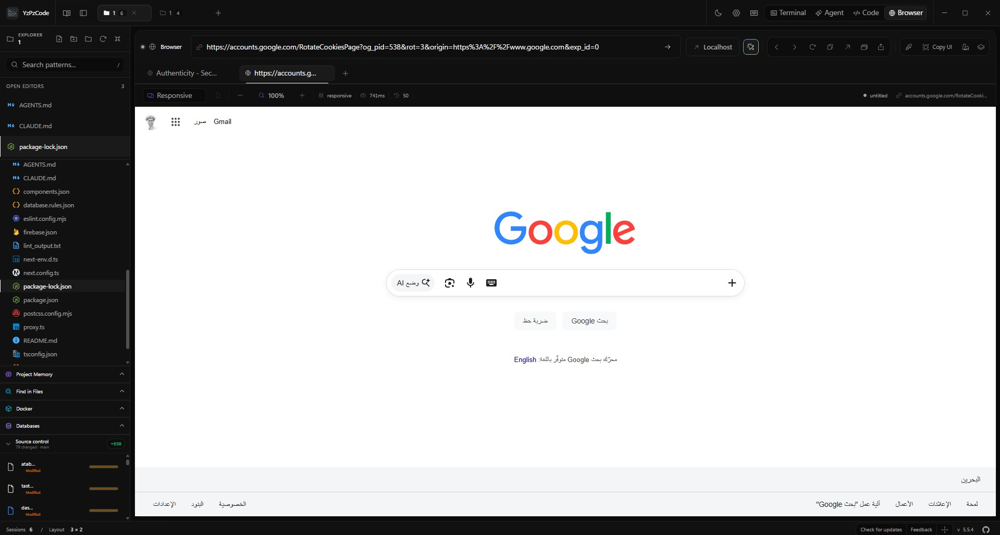
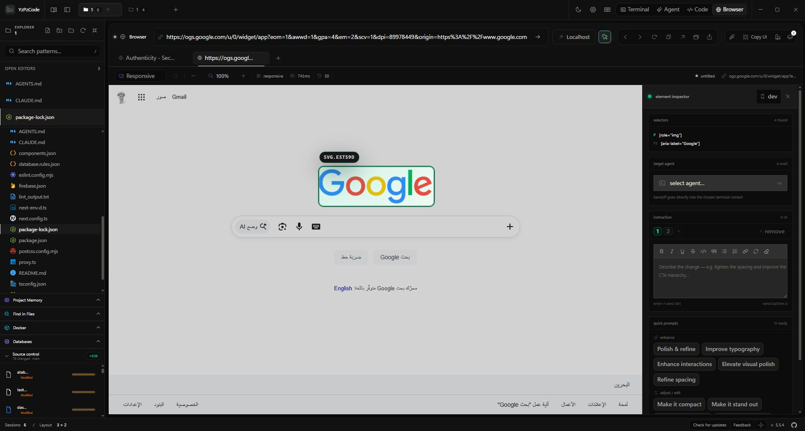

YzPzCode

The Unified Workspace for AI Coding Agents

Run Claude, Gemini, Codex, OpenCode, Cursor, Kilo, Hermes, Pi, Command Code, and the built-in YZPZ Agent from one native desktop workspace.

YzPzCode brings AI coding agents, real terminals, code editing, Git tools, browser inspection, visual design tools, and developer CLIs together — so you can stay focused on building instead of managing windows.

  
  
  

[!NOTE]
YzPzCode is under active development.
Some features may be experimental or change between releases. Bug reports, feedback, and contributions are welcome.

⸻

Table of Contents

* Why YzPzCode?
* See It in Action
* What You Can Do
* Supported AI Coding CLIs
* Core Features
* SaaS & Developer CLI Management
* Supported Development Environments
* Download & Installation
* YZPZ Agent
* Tech Stack
* Architecture
* Project Structure
* Customization
* Updates
* Security & Privacy
* Contributing
* License
* Contributors

⸻

Why YzPzCode?

Modern AI-assisted development often means juggling several terminals, coding agents, browser windows, editors, and developer tools at the same time.

YzPzCode brings them into one workspace.

Typical Workflow	With YzPzCode
Multiple terminal windows	One native application
Separate AI coding CLIs	Multiple agents in one workspace
Constant window switching	Side-by-side terminal grid
Separate editor and file browser	Monaco editor + integrated explorer
Separate browser for UI testing	Built-in browser + visual inspector
Repeated CLI setup	Detection, installation, and auth tracking
Scattered project context	Workspace-scoped sessions and tools

   
  
   

⸻

See It in Action

&nbsp;

Run agents, edit code, inspect interfaces, and manage your entire development workflow without leaving YzPzCode.

⸻

What You Can Do

Run Multiple AI Coding Agents

Launch supported AI coding CLIs in real PTY terminal sessions and arrange them side by side inside the same project workspace.

* Run multiple agents simultaneously
* Save and restore workspace presets
* Automatically detect locally installed CLIs
* Track authentication state
* Launch supported agents in external terminals when needed
* Keep terminal sessions scoped to the active workspace

Use the Built-In YZPZ Agent

YzPzCode includes its own AI coding agent experience, so an external CLI is not required.

* Streaming chat
* Tool execution logs
* Approval and permission controls
* Session history and resume
* Provider and model selection
* Custom API keys and base URLs
* Custom system prompts
* Token and context usage gauges
* Todos and sub-agent activity
* Agent Teams for multi-agent task orchestration
* Rich prompts with @ file mentions
* Per-agent slash-command reference

Work Without Leaving the App

Each workspace can include:

View	Purpose
Terminal View	Multi-pane PTY terminal grid
Agent View	Built-in YZPZ Agent
Editor View	Monaco-based editor with multiple tabs
Browser View	In-app browser and visual inspection tools
Image View	Built-in layered image editor

Multiple workspaces can remain open at the same time, each preserving its own terminal sessions, files, browser state, and active view.

⸻

Supported AI Coding CLIs

YzPzCode can detect and launch multiple AI coding tools from one workspace.

Agent	Command	Role
Claude	claude	AI coding and reasoning
Gemini	gemini	Multimodal AI development workflows
Codex	codex	AI-assisted coding workflows
OpenCode	opencode	Open-source coding agent
Cursor	cursor	AI-assisted development
Kilo	kilo	Coding agent workflows
Hermes	hermes	Terminal-based coding agent
Pi	pi	Minimal terminal coding harness
Command Code	cmd / cmdc	Coding workflow assistant

[!IMPORTANT]
YzPzCode integrates with third-party CLIs but is not affiliated with or endorsed by their respective vendors unless explicitly stated.

⸻

Core Features

Agent & Terminal Workspace

* Real PTY-backed terminal sessions
* Multi-agent grid
* Automated CLI detection and setup
* Workspace presets
* Authentication tracking
* Managed background and non-interactive commands
* PID, status, exit-code, and real-time output tracking
* External terminal launching
* Per-agent slash-command reference

Code, Files & Git

* Integrated file explorer
* Monaco-based multi-tab editor
* Syntax highlighting
* Find and replace
* Git status and diff statistics
* File watching
* Rich previews for supported document formats
* XLSX and CSV editing
* Draw.io preview support
* Multiple workspace tabs

In-App Browser

* Multi-tab browser
* Responsive device presets
* Orientation switching
* Zoom controls
* HTML snapshot export
* Pop-out mode

Visual Design Inspector

Inspect and capture UI details directly from webpages without constantly switching to external developer tools.

YzPzCode can inspect:

* HTML structure and selectors
* Element attributes
* Computed CSS styles
* Pseudo-element styles
* Layout and spacing
* Typography
* Colors
* Box model
* Assets
* Deep component structure

It also supports:

* Design intent analysis
* Style application with undo support
* Customizable quick prompts

   
  
  &nbsp;
  
    

AI Designer

Generate and iterate on UI designs using natural-language prompts.

* Prompt-based design generation
* Curated themes
* Multiple page types
* Responsive live preview
* Color controls
* Font controls
* Spacing controls
* Element inspection
* HTML/CSS/JS export
* Design history
* Skills management

Built-In Image Editor

A layered image editor is available directly inside the workspace.

Layer System

* Raster layers
* Image layers
* Text layers
* Shape layers
* Visibility controls
* Locking
* Opacity
* Rotation
* 16 blend modes

Editing Tools

* Move
* Marquee
* Lasso
* Crop
* Brush
* Eraser
* Fill
* Text
* Shapes
* Eyedropper
* Hand
* Zoom

Additional Capabilities

* Selection masks
* Undo history
* Layer properties
* Built-in color picker
* New, open, save, and flattened export workflows

Supported Formats

PNG · JPG · WebP · SVG · GIF · BMP · AVIF · TIFF

⸻

SaaS & Developer CLI Management

YzPzCode can detect, manage, and check authentication for supported developer tool CLIs.

Tool	Command
GitHub	gh
Stripe	stripe
Supabase	supabase
Valyu	valyu-cli
PostHog	posthog-cli
ElevenLabs	elevenlabs
Ramp	ramp
GWS	gws
AgentMail	agentmail-cli
Vercel	vercel

⸻

Supported Development Environments

YzPzCode can detect and launch supported development environments, including:

* Visual Studio Code
* Cursor
* Zed
* Visual Studio
* WebStorm
* IntelliJ IDEA
* Sublime Text
* Windsurf
* Perplexity
* Antigravity

⸻

Download & Installation

Download a Release

The easiest way to try YzPzCode is through the GitHub Releases page:

Download the latest YzPzCode release

Builds are intended for:

* Windows
* macOS
* Linux

⸻

Build From Source

Requirements

Before building YzPzCode, install:

* Node.js 18+
* Rust using the latest stable toolchain

Clone and Run

git clone https://github.com/wolfenazz/YzPzCode.git
cd YzPzCode/app
npm install
npm run tauri dev

YzPzCode will detect supported AI CLIs installed on your system and help configure the workspace.

Production Build

npm run tauri build

This generates a native installer for your current platform.

⸻

macOS

Install Rust first if needed:

curl --proto '=https' --tlsv1.2 -sSf https://sh.rustup.rs | sh

Restart your terminal after installation.

If you install an unsigned .dmg, macOS may require you to explicitly allow the application.

You can either:

1. Right-click the application and select Open
2. Go to System Settings → Privacy & Security → Open Anyway

[!NOTE]
Code signing is still being worked on for supported desktop platforms.

⸻

YZPZ Agent

 

Chat-driven coding with project context, tool visibility, approvals, and session history.

The built-in YZPZ Agent runs through a bundled Node.js sidecar harness that is started and supervised by the Rust host.

Key Capabilities

* Real-time streaming responses
* Tool-call visibility
* Interactive approvals
* Workspace-scoped session history
* Resume support
* Provider and model selection
* Optional custom API keys and endpoints
* Context compaction strategies
* Token usage and context-budget tracking
* Todos and sub-agents
* Agent Teams
* Rich prompts
* Workspace file mentions

⸻

Tech Stack

Layer	Technology
Frontend	React 19, TypeScript, Vite 6, Tailwind CSS v4, Zustand 5, xterm.js 6, Monaco Editor, Konva, Framer Motion
Desktop / Backend	Tauri v2, Rust, portable-pty, Tokio, tokio-tungstenite, serde, anyhow
Agent Sidecar	Node.js 22+, bundled agent harness, WebSocket server

YzPzCode uses Tauri and Rust for the desktop backend while the user interface is built with React and TypeScript.

⸻

Architecture

flowchart LR
    UI["React + TypeScript UI"]
    subgraph Workspace["Workspace"]
        Terminal["Terminal Grid"]
        AgentView["YZPZ Agent"]
        Editor["Monaco Editor"]
        Browser["Browser + Inspector"]
        Image["Image Editor"]
    end
    subgraph Core["Tauri + Rust Core"]
        IPC["Tauri Commands"]
        PTY["PTY Manager"]
        CLI["CLI Detection / Launching"]
        FS["Files + Git"]
        BrowserCore["Browser Manager"]
        Host["Agent Host"]
    end
    Harness["Node.js Agent Harness"]
    Agents["External AI / Tool CLIs"]
    UI --> Workspace
    Workspace --> IPC
    IPC --> PTY
    IPC --> CLI
    IPC --> FS
    IPC --> BrowserCore
    IPC --> Host
    PTY --> Agents
    CLI --> Agents
    Host <--> Harness

High-Level Flow

1. The React + TypeScript frontend provides the main workspace UI.
2. Workspace views communicate with the Tauri IPC layer.
3. The Rust core manages terminals, files, Git, browsers, CLIs, and agent processes.
4. External AI CLIs run through PTY or CLI management.
5. The built-in YZPZ Agent communicates with its bundled Node.js agent harness.

⸻

Project Structure

app/
├── src-tauri/
│   └── src/
│       ├── agent/              # Agent task execution and orchestration
│       ├── agent_cli/          # CLI detection, installation, and launching
│       ├── agent_host/         # Built-in YZPZ Agent host
│       ├── browser/            # Browser and visual inspector
│       ├── commands/           # Tauri IPC commands
│       ├── terminal/           # PTY sessions and command runner
│       ├── filesystem/         # Files, Git, validation, watchers
│       ├── ide/                # IDE detection and launching
│       └── discord_presence/   # Discord Rich Presence
│
├── src/
│   ├── components/
│   │   ├── setup/
│   │   ├── workspace/
│   │   ├── explorer/
│   │   ├── editor/
│   │   ├── image/
│   │   ├── designer/
│   │   ├── settings/
│   │   ├── feedback/
│   │   └── docs/
│   ├── hooks/
│   ├── stores/
│   └── types/
│
├── agent-harness/              # Bundled Node.js agent sidecar
└── docs/                       # Documentation

⸻

Customization

YzPzCode includes workspace and interface customization options for different developer preferences.

* Dark and light themes
* 8 accent colors
* 3 density levels
* Terminal font selection
* Custom cursor toggle
* Animation controls
* Reduced-motion support
* Workspace-specific state

⸻

Updates

YzPzCode includes Tauri updater integration with support for:

* Stable, Beta, and Nightly channels
* Update checks on launch
* Configurable auto-download
* Download progress
* One-click installation and relaunch

⸻

Security & Privacy

Because YzPzCode interacts with local projects, terminals, developer tools, and AI providers, security and transparency matter.

Please review the project’s:

* Security Policy
* Privacy Policy

[!IMPORTANT]
When using external AI providers or third-party CLIs, their own authentication, privacy, usage, and billing policies also apply.

⸻

Contributing

Contributions are welcome.

Development Checks

Frontend Type Checking

npx tsc --noEmit

Backend Checks

cargo check
cargo clippy
cargo fmt

Tests

cd src-tauri
cargo test

Found a Bug or Have an Idea?

You can:

* Open an issue
* Submit a pull request

For larger features, consider opening an issue before implementation so the approach can be discussed first.

⸻

License

YzPzCode is licensed under the Apache License 2.0.

Use it. Fork it. Build on it.

⸻

Contributors

<table>
<tr>
<td align="center" width="180">
<a href="https://github.com/wolfenazz">

  
<strong>Naz</strong>
 
Creator &amp; Lead Developer
 
<code>@wolfenazz</code>
</a>
</td>
<td align="center" width="180">
<a href="https://github.com/Noor-Al-Khelaifi">

  
<strong>Noor</strong>
 
Contributor &amp; Developer
 
<code>@Noor-Al-Khelaifi</code>
</a>
</td>
</tr>
</table>

⸻

Build with your AI agents, not around them.

YzPzCode is built for developers who want one place to run AI agents, inspect code, manage terminals, review files, test interfaces, and stay in flow.

 

Download YzPzCode
  •  
Documentation
  •  
Report a Bug
  •  
Request a Feature
  •  
Contribute

 

Built for developers. Designed for agent-powered workflows.

