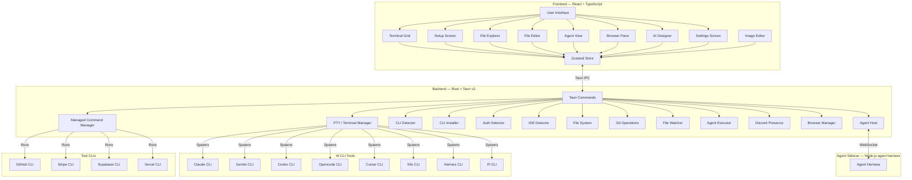

<div align="center">


<h1>YzPzCode</h1>

<p><strong>Your AI Coding Squad, One Window Away.</strong></p>

<p><i>Stop juggling 5 different terminals.<br>YzPzCode brings Claude, Gemini, Codex, Opencode, Cursor, Kilo, Hermes, Pi, and Command Code together in one clean interface —<br>plus 10 SaaS tool CLIs, an in-app browser with visual design inspector, an AI-powered designer,<br>and a Photoshop-style built-in image editor — plus a built-in AI coding agent (YZPZ Agent), running on a local agent harness.</i></p>

[](https://github.com/wolfenazz/YzPzCode/stargazers)
[](https://tauri.app)
[](https://react.dev)
[](https://rust-lang.org)
[](LICENSE)

<p>
<a href="https://github.com/wolfenazz/YzPzCode/releases">
  
</a>
&nbsp;
<a href="#-see-it-in-action">
  
</a>
&nbsp;
<a href="docs/userguid.md">
  
</a>
</p>

<br>

</div>

---

<p><i>Note: This app is under development, and maybe some features do not work probably. We are keeping updating the app more and more. In the future everything will be work Fully</i></p>

- The Problem

<div align="center">

| [!] The Old Way | [+] The YzPzCode Way |
|:--------------:|:-------------------:|
| Three terminal windows | **One app** |
| Three different CLIs | **All 9 AI agents inside** |
| Alt-tabbing like a maniac | **Side-by-side grid** |
| Separate browser for devtools | **In-app browser with inspector** |
| Copy-pasting between them | **Compare instantly** |
| Losing your mind | **Stay in flow** |

</div>

---

## - See It In Action

<div align="center">


<br><br>


<br><br>
<i>Clean. Fast. Powerful.</i>

</div>

<br>

[](docs/capture/MomentsDesktopclipfromApr132026.mp4)

<p align="center"><i>Watch YzPzCode in action - Video demo</i></p>

</div>

---

## Core Capabilities

<table>
<tr>
<td><b>Multi-Agent Grid</b><br><sub>Run Claude, Gemini, Codex, Kilo, Pi, and more in synchronized, side-by-side views.</sub></td>
<td><b>Automated Initialization</b><br><sub>Instantly detect and configure locally installed CLIs.</sub></td>
<td><b>Workspace Presets</b><br><sub>Save and restore optimal agent combinations for specific workflows.</sub></td>
<td><b>Native Terminals</b><br><sub>Powered by actual PTY sessions for authentic CLI interaction.</sub></td>
</tr>
<tr>
<td><b>Cross-Platform Support</b><br><sub>Optimized binaries for Windows, macOS, and Linux.</sub></td>
<td><b>Resource Efficient</b><br><sub>Built on Tauri and Rust, utilizing a fraction of the RAM required by Electron.</sub></td>
<td><b>Integrated Explorer</b><br><sub>Manage files and directories without leaving the application.</sub></td>
<td><b>Git Integration</b><br><sub>Monitor repository status and diff statistics at a glance.</sub></td>
</tr>
<tr>
<td><b>Monaco Editor</b><br><sub>Built-in Monaco-based multi-tab editor with syntax highlighting, find/replace, and rich file previews (PDF, DOCX, XLSX, PPTX, DrawIO, images).</sub></td>
<td><b>IDE Integration</b><br><sub>Seamlessly launch into over 10 supported development environments.</sub></td>
<td><b>Authentication Tracking</b><br><sub>Monitor credential states across all active CLI tools.</sub></td>
<td><b>Continuous Delivery</b><br><sub>Automated update mechanisms ensure access to the latest features.</sub></td>
</tr>
<tr>
<td><b>In-App Browser</b><br><sub>Webview-based browser with tabs, zoom, device presets, and snapshot export.</sub></td>
<td><b>Visual Design Inspector</b><br><sub>Inspect, capture, and apply styles from any webpage.</sub></td>
<td><b>AI Designer</b><br><sub>Prompt-based UI design generation with live preview and code export.</sub></td>
<td><b>Discord Rich Presence</b><br><sub>Show your workspace and activity on your Discord profile.</sub></td>
</tr>
<tr>
<td><b>Tool CLI Management</b><br><sub>Detect, install, and auth-check 10 SaaS CLIs (GitHub, Stripe, Supabase, Vercel, and more).</sub></td>
<td><b>Multi-Workspace</b><br><sub>Multiple open workspaces with tab switching and per-workspace state.</sub></td>
<td><b>Managed Commands</b><br><sub>Run non-interactive commands with status tracking and PID monitoring.</sub></td>
<td><b>UI Customization</b><br><sub>8 accent colors, 3 density levels, custom cursor, and animations toggle.</sub></td>
</tr>
<tr>
<td><b>YZPZ Agent</b><br><sub>Built-in AI coding agent (local agent harness sidecar) with streaming chat, tool logs, and session history.</sub></td>
<td><b>Agent Teams & Approvals</b><br><sub>Orchestrate sub-agents, approve tool requests, and track todos in real time.</sub></td>
<td><b>Rich Prompt Editor</b><br><sub>Formatting toolbar plus `@` file mentions that resolve to workspace paths.</sub></td>
<td><b>Inspector Quick Prompts</b><br><sub>One-click preset prompts (Enhance / Adjust) for the element inspector — fully customizable.</sub></td>
</tr>
<tr>
<td><b>Image Editor</b><br><sub>Photoshop-style built-in editor with a layer system, painting, selections, and undo history.</sub></td>
<td><b>Layer System</b><br><sub>Raster, image, text, and shape layers with opacity, locking, and 16 blend modes.</sub></td>
<td><b>Full Toolset</b><br><sub>Move, marquee, lasso, crop, brush, eraser, fill, text, shapes, eyedropper, zoom & hand tools.</sub></td>
<td><b>Image View</b><br><sub>Open PNG, JPG, WebP, SVG, GIF, BMP, AVIF & TIFF files right in the workspace.</sub></td>
</tr>
</table>

---

## - AI Agent CLIs

<div align="center">

<table>
<tr>
<td align="center" width="120">

<br><br><b>Claude</b><br><code>claude</code><br><sub>Deep reasoning, patient explanations</sub>
</td>
<td align="center" width="120">

<br><br><b>Gemini</b><br><code>gemini</code><br><sub>Fast, multimodal, Google's finest</sub>
</td>
<td align="center" width="120">

<br><br><b>Codex</b><br><code>codex</code><br><sub>Code generation that works</sub>
</td>
<td align="center" width="120">

<br><br><b>Opencode</b><br><code>opencode</code><br><sub>Open-source freedom</sub>
</td>
<td align="center" width="120">

<br><br><b>Cursor</b><br><code>cursor</code><br><sub>IDE-level AI assistance</sub>
</td>
<td align="center" width="120">

<br><br><b>Kilo</b><br><code>kilo</code><br><sub>Code agent for any task</sub>
</td>
<td align="center" width="120">

<br><br><b>Hermes</b><br><code>hermes</code><br><sub>Fast, efficient coding agent</sub>
</td>
<td align="center" width="120">

<br><br><b>Pi</b><br><code>pi</code><br><sub>Minimal terminal coding harness</sub>
</td>
<td align="center" width="120">

<br><br><b>Command Code</b><br><code>cmd / cmdc</code><br><sub>Learns your taste, applies it everywhere</sub>
</td>
</tr>
</table>

</div>

---

## - SaaS Tool CLIs

YzPzCode also manages and auth-checks these 10 tool CLIs:

<div align="center">

<table>
<tr>
<td align="center" width="100"><b>GitHub</b><br><code>gh</code></td>
<td align="center" width="100"><b>Stripe</b><br><code>stripe</code></td>
<td align="center" width="100"><b>Supabase</b><br><code>supabase</code></td>
<td align="center" width="100"><b>Valyu</b><br><code>valyu-cli</code></td>
<td align="center" width="100"><b>PostHog</b><br><code>posthog-cli</code></td>
</tr>
<tr>
<td align="center"><b>ElevenLabs</b><br><code>elevenlabs</code></td>
<td align="center"><b>Ramp</b><br><code>ramp</code></td>
<td align="center"><b>GWS</b><br><code>gws</code></td>
<td align="center"><b>AgentMail</b><br><code>agentmail-cli</code></td>
<td align="center"><b>Vercel</b><br><code>vercel</code></td>
</tr>
</table>

</div>

---

## - In-App Browser & Visual Design Tools

Built directly into the workspace — no more switching windows for web development:

- **Multi-Tab Browser**: Navigate and preview your apps in a webview pane
- **Device Presets**: Responsive, iPhone 14 Pro, iPad — switch orientation
- **Zoom Controls**: Fine-tune zoom from 50% to 200%
- **Snapshot Export**: Capture full page HTML
- **Pop-Out Mode**: Drag the browser to its own window

### Visual Design Inspector
- **Inspect Mode**: Hover over any element to see its HTML structure, selectors, and attributes
- **Pick Style Mode**: Click to capture computed CSS styles (with pseudo-elements) to a clipboard
- **Pick UI Element Mode**: Deep-capture an entire UI component — structure tree (up to 8 levels deep), layout grid, spacing, typography, colors, box model, assets, and auto-generated design intent analysis
- **Apply Mode**: Apply captured styles to target elements with undo support and CSS class generation
- **Quick Prompts**: One-click preset prompt chips (Enhance / Adjust groups) that pre-fill the instruction editor — fully customizable and resettable from Settings → Quick Prompts

---

## - AI Designer

Generate complete UI designs from natural language prompts:

- **Prompt-Based Generation**: Describe what you want, get a full design
- **Multiple Themes**: Choose from curated design themes
- **Page Types**: Landing pages, dashboards, and more
- **Live Preview**: See designs in responsive device frames
- **Customization Panel**: Tweak colors, fonts, and spacing
- **Element Inspector**: Inspect generated component properties
- **Code Export**: Export generated HTML/CSS/JS code
- **Design History**: Browse and restore previous design iterations
- **Skills Management**: Manage prompt engineering skills for better results

---

## - YZPZ Agent (Built-In AI Agent)

YzPzCode now ships with its own AI coding agent — no external CLI required:

- **Agent View**: A dedicated workspace view for chat-driven coding sessions, alongside the terminal, editor, and browser views
- **Local agent harness**: A Node.js sidecar harness (bundled with the app, started and supervised automatically by the Rust host) runs the agent engine
- **Streaming Chat**: Real-time message streaming with rich rendering of text, tool calls, results, and images
- **Tool Execution Logs**: Watch every tool call as it runs — status, input, and results in a live log
- **Approvals & Permissions**: Interactively approve or reject tool requests before they execute
- **Todos & Sub-Agents**: Live task lists and sub-agent activity tracking, plus **Agent Teams** that orchestrate multiple sub-agents on a task
- **Provider & Model Selection**: Choose any supported provider/model (with optional custom API keys and base URLs) and set a custom system prompt
- **Session History & Resume**: Sessions are scoped per workspace — browse history and resume anytime
- **Compaction Strategies**: Control context compaction to keep long-running sessions efficient
- **Usage & Context Gauges**: Track token usage and context budget in real time as you work
- **Rich Prompt Editor**: Format prompts (bold, italic, code, quotes, lists, links) and type `@` to fuzzy-search and attach workspace files
- **Per-Agent Slash Commands**: An in-app reference of available `/commands` for each supported agent CLI

---

## Supported Development Environments

<div align="center">

<table>
<tr>
<td align="center" width="100">
<br><sub>VS Code</sub>
</td>
<td align="center" width="100">
<br><sub>Cursor</sub>
</td>
<td align="center" width="100">
<br><sub>Zed</sub>
</td>
<td align="center" width="100">
<br><sub>Visual Studio</sub>
</td>
<td align="center" width="100">
<br><sub>WebStorm</sub>
</td>
</tr>
<tr>
<td align="center">
<br><sub>IntelliJ</sub>
</td>
<td align="center">
<br><sub>Sublime Text</sub>
</td>
<td align="center">
<br><sub>Windsurf</sub>
</td>
<td align="center">
<br><sub>Perplexity</sub>
</td>
<td align="center">
<br><sub>Antigravity</sub>
</td>
</tr>
</table>

</div>

---

## - Quick Start

> **You'll need:** Node.js 18+ and Rust (latest stable)

```bash
# 1. Clone it
git clone https://github.com/wolfenazz/YzPzCode.git
cd YzPzCode/app

# 2. Install dependencies
npm install

# 3. Run it
npm run tauri dev
```

The app will detect what AI CLIs you have installed and help you set up the rest.

<details>
<summary><b>- macOS Users</b></summary>

<br>

**Install Rust first:**
```bash
curl --proto '=https' --tlsv1.2 -sSf https://sh.rustup.rs | sh
```
Then restart your terminal before running `npm run tauri dev`.

**Installing from .dmg?** Since the app isn't code-signed yet:

| Option | How |
|--------|-----|
| **Right-click** | Right-click the app → Open → Click Open |
| **System Settings** | System Settings → Privacy & Security → Open Anyway |
| **Terminal** | `xattr -cr /Applications/YzPzCode.app` |

> **Note:** We're working on getting the app properly code-signed with Apple Developer and Microsoft certificates.

</details>

<details>
<summary><b>- Build for Production</b></summary>

<br>

```bash
npm run tauri build
```

Generates a native installer for your platform. Small, fast, no bloat.

</details>

---

## - How It's Built

<div align="center">

| Layer | Stack |
|:-----:|-------|
| **Frontend** | React 19 + TypeScript · Vite 6 · Tailwind CSS v4 · Zustand 5 · xterm.js 6 · Monaco Editor · Konva (react-konva) · framer-motion |
| **Backend** | Tauri v2 (Rust) · portable-pty · Tokio · WebSocket (tokio-tungstenite) · discord-rich-presence · anyhow/serde |
| **Agent Sidecar** | Node.js 22+ · bundled agent harness · WebSocket server |

</div>

### Architecture


```mermaid
graph TB
    subgraph Frontend["Frontend — React + TypeScript"]
        UI[User Interface]
        Grid[Terminal Grid]
        Browser[Browser Pane]
        Designer[AI Designer]
        Setup[Setup Screen]
        Store[Zustand Store]
        Explorer[File Explorer]
        Editor[File Editor]
        AgentView[Agent View]
        Settings[Settings Screen]
        ImageEditor[Image Editor]
    end

    subgraph Backend["Backend — Rust + Tauri v2"]
        Commands[Tauri Commands]
        PTY[PTY / Terminal Manager]
        Managed[Managed Command Manager]
        Detector[CLI Detector]
        Installer[CLI Installer]
        Auth[Auth Detector]
        Ide[IDE Detector]
        Fs[File System]
        Git[Git Operations]
        Watcher[File Watcher]
        Agent[Agent Executor]
        Discord[Discord Presence]
        BrowserMgr[Browser Manager]
        AgentHost[Agent Host]
    end

    subgraph Sidecar["Agent Sidecar — Node.js agent harness"]
        Harness[Agent Harness]
    end

    subgraph CLIs["AI CLI Tools"]
        Claude[Claude CLI]
        Gemini[Gemini CLI]
        Codex[Codex CLI]
        Opencode[Opencode CLI]
        Cursor[Cursor CLI]
        Kilo[Kilo CLI]
        Hermes[Hermes CLI]
        Pi[Pi CLI]
    end

    subgraph Tools["Tool CLIs"]
        Gh[GitHub CLI]
        Stripe[Stripe CLI]
        Supabase[Supabase CLI]
        Vercel[Vercel CLI]
    end

    UI --> Grid
    UI --> Browser
    UI --> Designer
    UI --> Setup
    UI --> Explorer
    UI --> Editor
    UI --> AgentView
    UI --> Settings
    Grid --> Store
    Setup --> Store
    Explorer --> Store
    Editor --> Store
    AgentView --> Store
    Browser --> Store
    Designer --> Store
    Settings --> Store
    ImageEditor --> Store
    
    Store <-->|Tauri IPC| Commands
    Commands --> PTY
    Commands --> Managed
    Commands --> Detector
    Commands --> Installer
    Commands --> Auth
    Commands --> Ide
    Commands --> Fs
    Commands --> Git
    Commands --> Watcher
    Commands --> Agent
    Commands --> Discord
    Commands --> BrowserMgr
    Commands --> AgentHost
    AgentHost <-->|WebSocket| Harness
    
    PTY -->|Spawns| Claude
    PTY -->|Spawns| Gemini
    PTY -->|Spawns| Codex
    PTY -->|Spawns| Opencode
    PTY -->|Spawns| Cursor
    PTY -->|Spawns| Kilo
    PTY -->|Spawns| Hermes
    PTY -->|Spawns| Pi
    Managed -->|Runs| Gh
    Managed -->|Runs| Stripe
    Managed -->|Runs| Supabase
    Managed -->|Runs| Vercel
```

---

## - Project Structure

```
app/
├── src-tauri/                      # Rust backend
│   └── src/
│       ├── agent/                  # Agent task execution & orchestration
│       ├── agent_cli/              # CLI detection, installation & launching
│       │   └── providers/          # 17 provider-specific implementations
│       ├── agent_host/             # Built-in YZPZ Agent engine host (local agent harness supervision)
│       ├── browser/                # In-app web browser + design inspector
│       ├── commands/               # Tauri IPC handlers (100+ commands)
│       ├── terminal/               # PTY sessions + managed command runner
│       ├── filesystem/             # File ops, git, watcher, validation
│       ├── ide/                    # IDE detection & launching (10 IDEs)
│       ├── discord_presence/       # Discord Rich Presence integration
│       └── utils/                  # Env setup, process helpers
├── src/                            # React frontend
│   ├── components/
│   │   ├── setup/                  # Setup & configuration screens
│   │   ├── workspace/              # Terminal grid, agent view, browser, sessions
│   │   ├── explorer/               # File explorer & git panels
│   │   ├── editor/                 # Monaco code editor + rich file previews
│   │   ├── image/                  # Built-in image editor (layers, paint, Konva)
│   │   ├── designer/               # AI-powered design tools
│   │   ├── settings/               # 12-section settings panel
│   │   ├── common/                 # Shared UI components
│   │   ├── feedback/               # User feedback modal
│   │   └── docs/                   # Built-in documentation viewer
│   ├── hooks/                      # Custom React hooks
│   ├── stores/                     # Zustand state management
│   └── types/                      # TypeScript definitions
├── agent-harness/                  # Node.js sidecar running the bundled agent harness
└── docs/                           # Documentation
```

---

## - Features Deep Dive

### Workspace Views
Switch between five views in any workspace:
1. **Terminal View** — Multi-pane PTY terminal grid
2. **Agent View** — Built-in YZPZ Agent chat with tool logs, approvals, and usage gauges
3. **Editor View** — Monaco-based multi-tab editor with syntax highlighting and rich file previews
4. **Browser View** — In-app web browser with dev tools
5. **Image View** — Photoshop-style image editor with layers, painting, selections, and history

### Multi-Workspace Tabs
Open multiple workspaces and switch between them with dedicated tabs. Each workspace maintains its own terminal sessions, open files, browser state, and active view.

### Managed Terminal Commands
Run non-interactive shell commands inside the app with full status tracking (Starting → Running → Completed/Failed), PID/exit-code monitoring, and real-time output streaming.

### Agent Task Execution
Describe a task in natural language — the app generates the appropriate shell command using your AI CLI, executes it, and retries up to 3 times on failure.

### Rich Prompt Editor
Format prompts with a rich-text toolbar (bold, italic, code, quotes, lists, links) and type `@` to fuzzy-search and attach workspace files to your prompt — used across the terminal and the built-in YZPZ Agent.

### Spreadsheet & Diagram Editing
Edit XLSX/CSV spreadsheets directly in-app with a Glide-Data-Grid-based spreadsheet editor, and preview `.drawio` diagrams with the bundled draw.io viewer (fetched and verified at install time, no CDN needed at runtime).

### Built-in Image Editor
A Photoshop-style image editor lives right inside the workspace — open any image file (PNG, JPG, WebP, SVG, GIF, BMP, AVIF, TIFF) or create a new document to start editing:

- **Layer System**: Raster, image, text, and shape layers with thumbnails, visibility, locking, opacity, rotation, and 16 blend modes
- **Full Toolset**: Move, rectangular/elliptical marquee, lasso, crop, brush, eraser, flood fill, eyedropper, text, shapes (rect/ellipse/line), and hand & zoom tools — with keyboard shortcuts
- **Selections**: Rect, ellipse, and lasso selection masks with inversion
- **Pixel-Accurate Painting**: Painting runs on offscreen per-layer canvases in document space
- **Undo History**: Full-document snapshots captured at every operation boundary
- **Properties & Color**: Layer properties panel and a built-in color picker
- **Survives View Switches**: The editor stays mounted across workspace view changes — documents, layers, and undo history are preserved
- **New / Open / Save**: Create documents (transparent/white/black background), open files, and export flattened images

### Terminal Fonts
Choose from bundled monospace fonts (Cascadia Mono, JetBrains Mono, Fira Code) or platform-native options — the terminal settings panel shows which fonts are built into your OS, which ship bundled with the app, and which need a manual install, complete with download links and per-OS install steps.

### Discord Rich Presence
Show what you're working on in your Discord profile — workspace name, activity details, and current state with timestamps.

### External Terminal Launch
Launch native OS terminals with any AI CLI pre-configured. Windows terminals are automatically tiled in a grid; macOS Terminal windows get positioned with AppleScript.

### UI Customization
- **8 Accent Colors**: default, blue, purple, green, orange, red, pink, cyan
- **3 Density Levels**: compact, comfortable, spacious
- **Custom Cursor**: Toggle-able animated cursor
- **Animation Toggle**: Disable animations for accessibility (reduced motion)
- **Dark/Light Theme**: Full theme support with CSS custom properties

### Auto-Updates
- Tauri updater integration with stable, beta, and nightly channels
- Automatic check on launch, configurable auto-download
- Download progress bar and one-click install with relaunch

### 12 Settings Sections
Appearance, Terminal, Editor, Agents, **AI Agents (Provider Configs)**, Workspace, IDE, Updates, Environment, Data, About, Shortcuts

---

## - Contributing

```bash
# Type checking
npx tsc --noEmit          # Frontend
cargo check               # Backend

# Linting & formatting
cargo clippy              # Catch Rust issues
cargo fmt                 # Make it pretty

# Testing
cd src-tauri && cargo test
```

Found a bug? Have an idea? [Open an issue](https://github.com/wolfenazz/YzPzCode/issues) · [Submit a PR](https://github.com/wolfenazz/YzPzCode/pulls)

---

## - Recommended Setup

[](https://code.visualstudio.com)
[](https://marketplace.visualstudio.com/items?itemName=rust-lang.rust-analyzer)
[](https://marketplace.visualstudio.com/items?itemName=tauri-apps.tauri-vscode)

---

## - License

[](LICENSE)

Fork it. Build on it. Make it yours.

---

<br>

<div align="center">

### - Like What You See?

If YzPzCode saved you from terminal chaos, consider giving it a **star** it helps others find it too!

[](https://github.com/wolfenazz/YzPzCode/stargazers)

<br><br>

---

**Built with <3 and late nights by**

<br>

<table>
<tr>
<td align="center" width="150">
<a href="https://github.com/wolfenazz">

<br><br>
<b>Naz</b>
<br>
<sub>Creator & Lead Dev</sub>
<br>
<a href="https://github.com/wolfenazz"><code>@wolfenazz</code></a>
</a>
</td>
<td align="center" width="150">
<a href="https://github.com/Noor-Al-Khelaifi">

<br><br>
<b>Noor</b>
<br>
<sub>Contributor and dev</sub>
<br>
<a href="https://github.com/Noor-Al-Khelaifi"><code>@Noor-Al-Khelaifi</code></a>
</a>
</td>
</tr>
</table>

<br>

<i>For developers who'd rather code than manage terminals.</i>

<br><br>

[](https://github.com/wolfenazz/YzPzCode/issues)
[](https://github.com/wolfenazz/YzPzCode/issues)
[](https://github.com/wolfenazz/YzPzCode/pulls)

</div>
