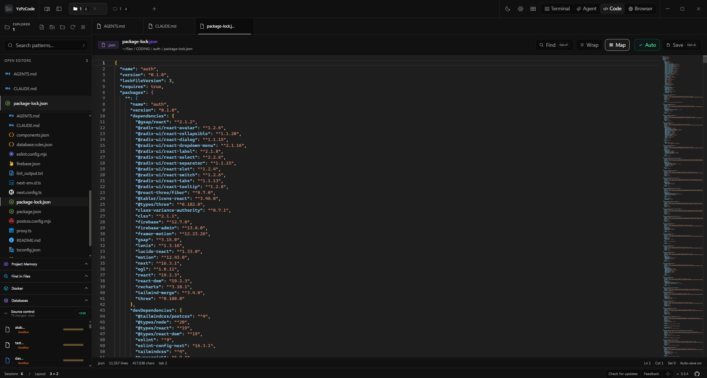
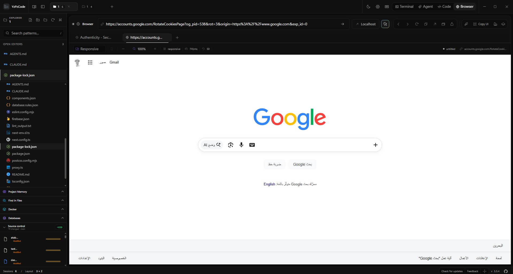
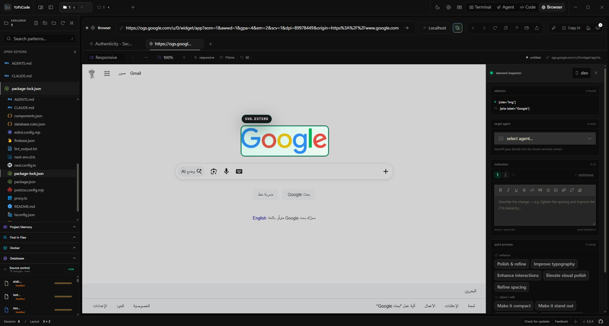
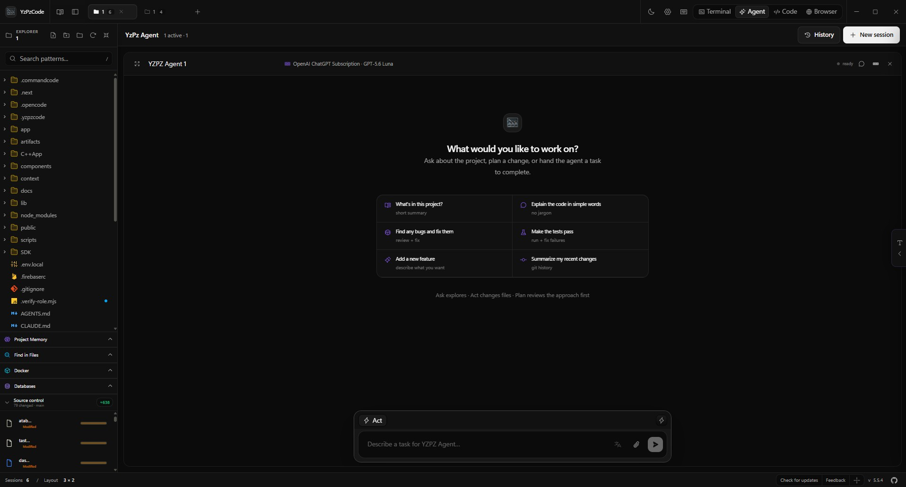
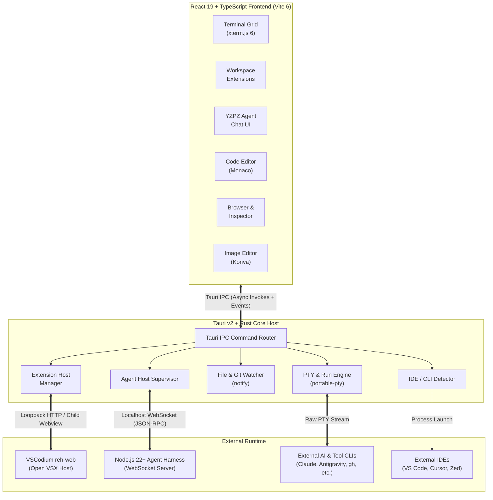

<div align="center">


# YzPzCode

### The Unified Workspace for AI Coding Agents

**Run 26 external AI coding CLIs, 10 developer tool CLIs, Graphical Workspace Extensions, and the built-in YZPZ Agent from one native desktop application.**

<p align="center">
  <a href="https://github.com/wolfenazz/YzPzCode/releases/latest">
    
  </a>
  <a href="https://github.com/wolfenazz/YzPzCode/blob/main/LICENSE">
    
  </a>
  <a href="docs/userguid.md">
    
  </a>
  <a href="https://github.com/wolfenazz/YzPzCode/issues">
    
  </a>
  
</p>

<p align="center">
  <a href="#-why-yzpzcode">Why YzPzCode?</a> •
  <a href="#-see-it-in-action">Screenshots</a> •
  <a href="#-supported-ai-coding-clis">AI Agents</a> •
  <a href="#-graphical-workspace-extensions">Extensions</a> •
  <a href="#-application-run--build-system">Run & Build</a> •
  <a href="#-core-features">Features</a> •
  <a href="#-yzpz-agent">Built-in Agent</a> •
  <a href="#-download--installation">Download</a> •
  <a href="#-architecture">Architecture</a> •
  <a href="#-contributors">Contributors</a>
</p>

---


</div>

> [!NOTE]
> **YzPzCode is under active development.** Some features may be experimental or evolve between releases. Feedback, bug reports, and pull requests are warmly welcomed!

---

## ⚡ Why YzPzCode?

Modern AI-assisted development often degrades into a chaotic shuffle between dozens of terminal tabs, scattered coding agents, disconnected browsers, IDEs, and ad-hoc CLI tools.

**YzPzCode replaces the window juggling with a single, coherent command center.**

| Traditional Workflow | With YzPzCode |
| :--- | :--- |
| 🪟 8+ disconnected terminal windows | 🖥️ **Single native workspace** with custom layouts |
| 🔄 Constant `Alt+Tab` context switching | 🎛️ **Side-by-side terminal grid** with PTY sessions |
| 🔌 Siloed extension panels locked in external IDEs | 🧩 **Graphical workspace extensions** embedded right in the grid |
| ⚙️ Manual build scripts & fragmented run commands | ⚡ **Smart run & build system** with 15+ ecosystem auto-detection |
| 🧩 External editor + external file viewer | 📝 **Embedded Monaco editor** + virtualized file tree |
| 🔄 Desynchronized file state across tools | 🔄 **Transactional file sync** & recursive filesystem watcher |
| 🌐 Separate browser for UI validation | 🔍 **In-app browser** with deep CSS / visual inspector |
| ⚙️ Repetitive CLI install & auth checks | 🔑 **Automatic detection, 1-click install & auth tracking** |
| 💬 Isolated AI chats with lost context | 🤖 **Built-in YZPZ Agent** + 26 supported external AI CLIs |
| 🎨 Switching to Photoshop / Figma for quick edits | 🖌️ **Built-in layered image editor** with blend modes |

---

## 📸 See It in Action

<div align="center">
  <table>
    <tr>
      <td width="50%" align="center">
        
        <br />
        <sub><b>Terminal Grid & Workspace Explorer</b></sub>
      </td>
      <td width="50%" align="center">
        
        <br />
        <sub><b>Multi-Agent Collaborative Layout</b></sub>
      </td>
    </tr>
    <tr>
      <td width="50%" align="center">
        
        <br />
        <sub><b>Integrated Multi-Tab Webview Browser</b></sub>
      </td>
      <td width="50%" align="center">
        
        <br />
        <sub><b>Deep Visual Element & Style Inspector</b></sub>
      </td>
    </tr>
  </table>
</div>

---

## 🤖 Supported AI Coding CLIs

YzPzCode detects, launches, and manages PTY sessions for 26 external AI coding agents. The core integrations include:

```
                     ┌─── Claude (Anthropic)
                     ├─── Antigravity (Google)
                     ├─── Codex (OpenAI)
                     ├─── OpenCode
  YzPzCode Host ─────┼─── Cursor
                     ├─── Kilo
                     ├─── Hermes
                     ├─── Pi (earendil-works)
                     └─── Command Code
```

| Agent | CLI Command | Primary Role & Strengths |
| :--- | :---: | :--- |
| **Claude Code** | `claude` | Deep reasoning, autonomous refactoring, large context |
| **Antigravity CLI** | `agy` | Autonomous task execution, agentic workflows, Google AI |
| **Codex CLI** | `codex` | Precision code generation & unit test authoring |
| **OpenCode** | `opencode` | Open-source agent for customizable local workflows |
| **Cursor CLI** | `cursor` | Agentic file editing and codebase indexing |
| **Kilo** | `kilo` | Fast, terminal-native agent workflows |
| **Hermes** | `hermes` | Compact autonomous terminal assistant |
| **Pi** | `pi` | Minimalist coding agent harness with extension hooks |
| **Command Code** | `cmd` / `cmdc` | Interactive command & script orchestration |

Additional integrations include:

| Agent | CLI Command | Agent | CLI Command |
| :--- | :---: | :--- | :---: |
| **Cline CLI** | `cline` | **Grok CLI** | `grok` |
| **Devin for Terminal** | `devin` | **Trae CLI** | `traecli` |
| **Kimi Code CLI** | `kimi` | **Qoder CLI** | `qoder` |
| **GitHub Copilot CLI** | `copilot` | **Kiro CLI** | `kiro-cli` |
| **Mistral Vibe** | `vibe` | **DeepSeek TUI** | `deepseek` |
| **Aider** | `aider` | **Amp** | `amp` |
| **DeepSeek Reasonix** | `reasonix` | **CodeBuddy Code** | `codebuddy` |
| **DeepSeek Harness** | `dsh` | **AtomCode CLI** | `atomcode` |
| **MiMo Code** | `mimo` | | |

See [the CLI integration reference](docs/cli-integrations.md) for vendor install instructions, documentation, and platform notes.

> [!IMPORTANT]
> YzPzCode integrates with third-party CLIs via PTY bridges and is **not affiliated with or endorsed by their respective vendors** unless explicitly stated.

---

## 🛠️ SaaS & Developer Tool CLIs

YzPzCode automatically tracks installation status, executable paths, and authentication state for popular cloud & developer CLIs:

<div align="center">

| Service | Command | Service | Command |
| :--- | :---: | :--- | :---: |
| **GitHub CLI** | `gh` | **PostHog** | `posthog-cli` |
| **Supabase** | `supabase` | **ElevenLabs** | `elevenlabs` |
| **Stripe** | `stripe` | **Google Workspace** | `gws` |
| **Vercel** | `vercel` | **AgentMail** | `agentmail-cli` |
| **Valyu** | `valyu-cli` | **Ramp** | `ramp` |

</div>

See [the Tool CLIs reference guide](docs/ToolCLIs.md) for workflows, common commands, and authentication details.

---

## 🧩 Graphical Workspace Extensions

Run your favorite graphical coding assistants and visual extension webviews directly alongside shell and AI agent terminals inside the workspace grid.

<div align="center">
  <p><b>Press <code>Ctrl+Shift+X</code> or click the Extensions icon in the header to open the curated catalog.</b></p>
</div>

| Extension | Publisher | Description |
| :--- | :--- | :--- |
| **Google Antigravity** | Google | Google's official agentic assistant with chat, plans, and code edits. |
| **Kilo Code** | Kilo | Code, plan, and debug with Kilo's visual extension panel. |
| **Cline** | Cline | Autonomous coding assistant with plan/act modes and tool approval gates. |
| **OpenAI Codex** | OpenAI | OpenAI's coding extension with ChatGPT sign-in and code assistance. |
| **Claude Code** | Anthropic | Anthropic's visual coding assistant and conversation panel. |
| **Continue** | Continue | Open-source agent and code chat with cloud or local model backends. |
| **Amazon Q Developer** | AWS | Code chat and inline feature development with Amazon Q. |
| **Tabby** | TabbyML | Self-hosted coding assistant connected to a private Tabby server. |
| **Windsurf Plugin** | Windsurf | Codeium assistant with AI code chat and codebase index. |
| **Mistral Vibe** | Mistral AI | Mistral's visual coding agent with context, conversations, and tools. |

- 🎛️ **Side-by-Side Grid Layouts**: Extension panels mount right inside the terminal grid with drag-and-drop reordering, interactive resizing, focus presets (`focus-left`, `focus-right`), and split layouts.
- 📦 **Zero-Config Managed Runtime**: Automatically provisions a verified VSCodium `reh-web` runtime using pinned SHA-256 digests and Open VSX packages. No external VS Code or Node installation needed.
- 🛡️ **Hardened Sandboxing**: Each assistant runs in an isolated child webview on its own `panel-<uuid>.localhost:<port>` origin with persistent storage. Extension webviews are strictly restricted from calling Tauri host application commands.
- 🔒 **Workspace Trust & State Persistence**: Preserves workspace trust approvals (`workspace-trust.json`) and transactionally synchronizes IndexedDB workbench state (`workbench-state.json`) per workspace.

See [the graphical workspace extensions documentation](docs/extensions.md) for architecture, runtime specifications, and validation details.

---

## ⚡ Application Run & Build System

Launch, build, and debug your applications with zero configuration. YzPzCode automatically discovers project manifests and runnable entry points across 15+ ecosystems directly inside terminal headers:

<div align="center">

| Ecosystem | Detection & Execution Capabilities |
| :--- | :--- |
| **Python** | Detects `.py` scripts, `main.py`, `app.py`, Django `manage.py`, Flask & FastAPI servers. Prioritizes local `.venv`, `venv`, or system Python. |
| **JavaScript / TypeScript** | Discovers `package.json` dev, start, and build scripts. Automatically invokes `npm`, `pnpm`, `Yarn`, or `Bun` based on project lockfiles. |
| **Rust / Go / Flutter** | Native support for Cargo (`cargo run`), Go modules (`go run .`), and Flutter project manifests (`flutter run`). |
| **C / C++** | Automatically discovers source files containing `main()`, compiles dependencies via GCC or Clang into `.yzpz-run/`, and executes the binary. |
| **CMake** | Interrogates the CMake File API to locate Debug build targets in `.yzpz-build/` with seamless compilation before launch. |
| **C# (.NET)** | Discovers and runs executable `.csproj` files within projects and solution directories using the .NET SDK. |
| **Java** | Direct single-file source execution via JDK 11+ and project launch configurations. |
| **Ruby, PHP, Dart, Swift, Lua, Perl, R** | Runs project entry points with installed system interpreters; supports Rails and Laravel manifest commands. |

</div>

- ▶️ **One-Click Run & Build**: Trigger runs or isolated compilation steps directly from the terminal header with instant target switching.
- 💬 **Interactive Stdin Console Pipe**: Send input to running console applications (`input()`, `scanf`, `Console.ReadLine()`) directly from the terminal input bar.
- 🌐 **Dev-Server Localhost Auto-Discovery**: Automatically recognizes localhost URLs emitted by dev servers in terminal output and surfaces a 1-click preview button in the browser bar.
- ⚙️ **Custom Run Configurations**: Define and persist custom commands, environment variables, arguments, and working directories in **Settings → Application runs** (scoped globally or per workspace).

See [the application runs guide](docs/application-runs.md) for full configuration schemas, multi-target switching, and compiler details.

---

## ✨ Core Features

### 🖥️ 1. Multi-Agent Terminal Grid
- **Real PTY Backend**: Full xterm.js 6 frontend powered by Rust's `portable-pty`
- **Managed Commands**: Run non-interactive / background tasks with PID, exit code, and live output streaming
- **Terminal Mouse Modes**: Full xterm mouse reporting protocol (click, drag, any-event, application mouse tracking) for interactive TUIs and CLI tools
- **Hardware-Accelerated Rendering**: Canvas/WebGL rendering pipeline optimizations with dirty-rectangle updates for ultra-low latency throughput
- **Workspace Scoping**: Terminal sessions are isolated per project workspace
- **Redesigned Spawn Dialog**: Searchable modal categorized by shells, primary AI agents, additional agents, and SaaS tool CLIs with real-time status badges
- **External Terminal Tiling**: Spawn external native consoles (Windows Terminal, macOS Terminal, Linux) with auto-tiling

### ⚡ 2. Application Run & Build System
- **Zero-Config Detection**: Automatic target and manifest discovery across 15+ programming languages and frameworks
- **Terminal Header Controls**: Instant Run and Build triggers with multi-target selection dropdowns
- **Interactive Stdin Streaming**: Direct input piping into running console programs (`input()`, `scanf`, etc.)
- **Dev-Server Auto-Preview**: Automatic detection of localhost URLs in terminal logs linking directly to the in-app browser
- **Saved Configurations**: Scoped run configurations customizable in Settings with custom arguments and environment variables

### 🧩 3. Graphical Workspace Extensions
- **Curated Open VSX Catalog**: 1-click install for leading visual coding extensions (Google Antigravity, Kilo Code, Cline, Codex, Claude Code, Continue, Amazon Q, Tabby, Windsurf, Mistral Vibe)
- **Grid Layout Integration**: Mix and match graphical webview panels with interactive PTY terminal sessions
- **Strict Security Boundaries**: Isolated child webviews with connection tokens, local origins, and app command rejection
- **Durable Profile Persistence**: Workspace-scoped profiles, persistent authentication, and synchronized trust gates

### 🤖 4. Built-In YZPZ Agent
- **Native AI Sidecar**: Powered by a supervised Node.js harness over WebSockets
- **Zero-Setup Required**: Ready to chat, execute tools, and manipulate files without external CLIs
- **Full Transparency**: Streaming tokens, tool-call logs, permission approval gates, and context-window meters
- **Agent Teams & Mentions**: Orchestrate multi-agent subtasks and reference project files with `@filename`

### 📝 5. Monaco-Based Code Editor & Source Control
- **Multi-Tab Workspace**: Split views, tab management (close others / right / saved)
- **Syntax Highlighting & Minimap**: Rich language support via Monaco + CodeMirror engines
- **Rich File Previews**: Markdown, PDF, CSV, Excel (`.xlsx`), Word (`.docx`), and Draw.io diagrams
- **Transactional File Sync**: High-speed recursive filesystem watcher (`notify`) with debounced synchronization keeping open editor tabs in sync with external IDEs and agents
- **Integrated Git Source Control**: Branch switching, diff statistics, staging/unstaging individual files or hunk diffs, discard changes, commit workflow, and remote sync

### 🌐 6. In-App Browser & Visual Inspector
- **Device Presets**: Emulate iPhone, iPad, responsive desktop; toggle portrait/landscape
- **Deep Element Inspector**: Inspect computed CSS, pseudo-elements, box model, and DOM hierarchy
- **Style Picker & Generator**: Capture styles directly to clipboard, generate atomic CSS classes, and apply with full undo stack
- **Dev-Server Integration**: Instant 1-click browser preview when development servers emit local URLs

### 🎨 7. AI Designer & Layered Image Editor
- **Prompt-to-UI Generator**: Produce responsive HTML/CSS/JS interfaces directly from natural language prompts
- **Full Layered Canvas**: Raster, vector, text, and shape layers powered by Konva
- **16 Blend Modes**: Full layer opacity, rotation, masking, marquee/lasso selections, and history
- **Multi-Format Export**: PNG, JPG, WebP, SVG, GIF, BMP, AVIF, TIFF

---

<a id="-yzpz-agent"></a>
## 🧠 YZPZ Agent: Under the Hood

<div align="center">
  
  <br />
  <sub><b>Interactive Agent Chat with tool execution logs, approval controls, and token context meter</b></sub>
</div>

<br />

The built-in **YZPZ Agent** runs as an isolated Node.js sidecar process supervised directly by the Tauri Rust host:

- ⚡ **Real-Time Streaming**: Incremental token delivery via low-latency WebSocket connection
- 🛡️ **Permission Controls**: Approve or reject bash commands, file writes, and external network requests
- 🔄 **Session Persistence**: Resumable workspace-scoped sessions stored locally
- 🎯 **Model Flexibility**: Connect to OpenAI, Anthropic, Gemini, Ollama, DeepSeek, or any custom OpenAI-compatible endpoint
- 📊 **Context Awareness**: Real-time context budget tracking, automatic compaction strategies, and token cost estimation

---

## 🏗️ Architecture


```mermaid
flowchart TB
    subgraph Frontend["React 19 + TypeScript Frontend (Vite 6)"]
        direction LR
        UI_Term["Terminal Grid\n(xterm.js 6)"]
        UI_Ext["Workspace\nExtensions"]
        UI_Agent["YZPZ Agent\nChat UI"]
        UI_Editor["Code Editor\n(Monaco)"]
        UI_Browser["Browser &\nInspector"]
        UI_Image["Image Editor\n(Konva)"]
    end

    subgraph TauriHost["Tauri v2 + Rust Core Host"]
        IPC["Tauri IPC Command Router"]
        PTY["PTY & Run Engine\n(portable-pty)"]
        ExtHost["Extension Host\nManager"]
        FS["File & Git Watcher\n(notify)"]
        Host["Agent Host Supervisor"]
        DevEnv["IDE / CLI Detector"]
    end

    subgraph External["External Runtime"]
        ExtRuntime["VSCodium reh-web\n(Open VSX Host)"]
        Harness["Node.js 22+ Agent Harness\n(WebSocket Server)"]
        CLIs["External AI & Tool CLIs\n(Claude, Antigravity, gh, etc.)"]
        IDEs["External IDEs\n(VS Code, Cursor, Zed)"]
    end

    Frontend <==>|"Tauri IPC (Async Invokes + Events)"| IPC
    IPC --> PTY
    IPC --> ExtHost
    IPC --> FS
    IPC --> Host
    IPC --> DevEnv

    PTY <==>|"Raw PTY Stream"| CLIs
    ExtHost <==>|"Loopback HTTP / Child Webview"| ExtRuntime
    Host <==>|"Localhost WebSocket (JSON-RPC)"| Harness
    DevEnv -.->|"Process Launch"| IDEs
```

### Technology Matrix

| Layer | Technologies |
| :--- | :--- |
| **Desktop Shell** | [Tauri v2](https://v2.tauri.app/), [Rust](https://www.rust-lang.org/) (2021 Edition) |
| **Concurrency & PTY** | `tokio`, `portable-pty`, `tokio-tungstenite`, `notify`, `which` |
| **Extension Host** | VSCodium `reh-web` (Open VSX), Sandboxed Child WebViews (`panel-*.localhost`) |
| **Frontend Framework** | [React 19](https://react.dev/), [TypeScript 5.6](https://www.typescriptlang.org/), [Vite 6](https://vitejs.dev/) |
| **Styling & Motion** | [Tailwind CSS v4](https://tailwindcss.com/), [Framer Motion](https://www.framer.com/motion/) |
| **Terminal & Editor** | [@xterm/xterm 6](https://xtermjs.org/), [Monaco Editor](https://microsoft.github.io/monaco-editor/), CodeMirror 6 |
| **Canvas & Media** | [Konva](https://konvajs.org/), `pdfjs`, `xlsx`, `mammoth` |
| **State Management** | [Zustand 5](https://github.com/pmndrs/zustand) (with persistent storage) |

---

## 📂 Project Structure

```text
yzpzcode/
├── .github/workflows/          # CI/CD Release workflows (multi-platform builds)
├── docs/                       # Guides (application runs, extensions, ToolCLIs), screenshots
└── app/
    ├── src-tauri/              # Rust backend
    │   └── src/
    │       ├── agent/          # Autonomous agent task orchestration & retry logic
    │       ├── agent_cli/      # AI & Tool CLI detection, installation & auth
    │       ├── agent_host/     # Supervisor for built-in Node.js agent harness
    │       ├── browser/        # Webview management & visual inspector bridge
    │       ├── commands/       # Tauri IPC commands (~100+ endpoints)
    │       ├── extension_host/ # Embedded VSCodium web runtime manager, Open VSX & VSIX sandboxing
    │       ├── terminal/       # PTY sessions, application run engine & managed commands
    │       ├── filesystem/     # Recursive watcher, transactional file sync, Git ops & diffs
    │       ├── ide/            # External IDE launcher (VS Code, Cursor, Zed, etc.)
    │       └── discord_presence/ # Discord Rich Presence integration
    │
    ├── src/                    # React 19 frontend
    │   ├── components/         # Modular UI components
    │   │   ├── workspace/      # Terminal grid, extension panels, aurora background, browser, view switchers
    │   │   ├── editor/         # Monaco editor tabs & rich file previews
    │   │   ├── explorer/       # Virtualized file tree & Git panels
    │   │   ├── designer/       # AI design generation studio
    │   │   ├── image/          # Layered canvas image editor
    │   │   ├── settings/       # 11-section preferences panel (runs, aurora, agents, etc.)
    │   │   └── setup/          # Interactive onboarding wizard
    │   ├── hooks/              # Custom React hooks (useTerminal, useBrowser, useFileWatcher, etc.)
    │   ├── stores/             # Zustand global state stores (appStore, runConfigStore, extensionStore)
    │   └── types/              # TypeScript mirror interfaces of Rust structs
    │
    └── agent-harness/          # Supervised Node.js sidecar for YZPZ Agent
```

---

## 🚀 Download & Installation

### Option 1: Pre-Built Binaries (Recommended)

Grab the latest installer for your operating system from the **[Releases Page](https://github.com/wolfenazz/YzPzCode/releases/latest)**:

| Platform | Package Format | Architecture |
| :--- | :--- | :--- |
| **🪟 Windows** | `.msi` / `.exe` installer | x86_64 |
| **🍎 macOS** | `.dmg` installer | Apple Silicon (`aarch64`) & Intel (`x86_64`) |
| **🐧 Linux** | `.deb` / `.AppImage` | x86_64 |

> [!TIP]
> **macOS Note**: If running an unsigned build, open with **Right Click → Open**, or allow it under *System Settings → Privacy & Security → Open Anyway*.

---

### Option 2: Build From Source

#### Prerequisites
- **Node.js**: `22.x` or higher
- **Rust**: Latest stable toolchain (`rustup update stable`)
- **C++ Build Tools**: Visual Studio Build Tools (Windows) / Xcode CLI Tools (macOS) / `build-essential` (Linux)

#### 1. Clone the repository
```bash
git clone https://github.com/wolfenazz/YzPzCode.git
cd YzPzCode/app
```

#### 2. Install dependencies
```bash
# Install frontend dependencies
npm install

# Install agent harness dependencies
cd agent-harness && npm install && cd ..
```

#### 3. Run in development mode
```bash
npm run tauri dev
```

#### 4. Build production installer
```bash
npm run tauri build
```
The compiled binaries will be output to `app/src-tauri/target/release/bundle/`.

---

## 🎨 UI Customization

Tailor YzPzCode to your aesthetic and workflow preferences:

- 🌗 **Dark / Light Modes**: Full dynamic theming across the entire UI
- 🎨 **8 Accent Color Schemes**: Default, Blue, Purple, Green, Orange, Red, Pink, Cyan
- 🌌 **Animated Workspace Aurora**: GPU-accelerated ambient aurora background for workspaces with customizable color presets (`gemini`, `sage`, `accent`, `custom`), intensity, speed, blur, and opacity controls (**Settings → Appearance → Workspace Aurora**)
- 💎 **Modernized App Chrome**: Sleek view switcher tabs, interactive status indicators, and real-time process monitoring in the footer chrome
- 📐 **3 Density Presets**: Compact, Comfortable, Spacious
- ⌨️ **Terminal Styling**: Configurable font families, ligatures, cursor styles, mouse tracking modes, and opacity
- ✨ **Accessibility**: Animation disable toggle (reduced-motion compliance), custom cursor toggle

---

## 🔒 Security & Privacy

YzPzCode was built with a **local-first** security philosophy:

- 🛡️ **Your Code Stays Local**: No project files or source code are ever uploaded to third-party servers by YzPzCode itself.
- 🔑 **Locally Stored Secrets**: API keys and tokens are stored exclusively on your local machine.
- 🚪 **Explicit Permission Gates**: The built-in agent requires explicit user confirmation before executing shell commands or writing destructive changes.
- 📡 **Direct Provider Connections**: When you configure API keys for Anthropic, OpenAI, or other LLMs, requests are dispatched directly to their official endpoints.

---

## 🤝 Contributing

Contributions make open source incredible! Any bugs found, improvements, or new features are appreciated.

### Quality Checklist before Submitting PRs
```bash
# 1. Typecheck the frontend
cd app && npx tsc --noEmit

# 2. Check Rust formatting & lints
cd src-tauri
cargo fmt --check
cargo clippy -- -D warnings

# 3. Run unit & integration tests
cargo test
```

Please check [open issues](https://github.com/wolfenazz/YzPzCode/issues) or start a discussion before proposing major architectural changes.

---

## 👥 Contributors

A huge thank you to everyone building and refining YzPzCode:

<div align="center">
  <table>
    <tr>
      <td align="center" width="200">
        <a href="https://github.com/wolfenazz">
          
          <br /><br />
          <b>Naz</b>
          <br />
          <sub>Creator & Lead Architect</sub>
          <br />
          <code>@wolfenazz</code>
        </a>
      </td>
      <td align="center" width="200">
        <a href="https://github.com/Noor-Al-Khelaifi">
          
          <br /><br />
          <b>Noor</b>
          <br />
          <sub>Core Contributor & Developer</sub>
          <br />
          <code>@Noor-Al-Khelaifi</code>
        </a>
      </td>
    </tr>
  </table>
</div>

---

## 📄 License

YzPzCode is open-source software licensed under the **[Apache License 2.0](LICENSE)**.

<div align="center">
  <br />
  <b>Build with your AI agents, not around them.</b>
  <br /><br />
  <a href="https://github.com/wolfenazz/YzPzCode/releases/latest">Download YzPzCode</a> •
  <a href="docs/userguid.md">Documentation</a> •
  <a href="https://github.com/wolfenazz/YzPzCode/issues/new">Report Bug</a> •
  <a href="https://github.com/wolfenazz/YzPzCode/issues/new">Request Feature</a>
  <br /><br />
</div>
