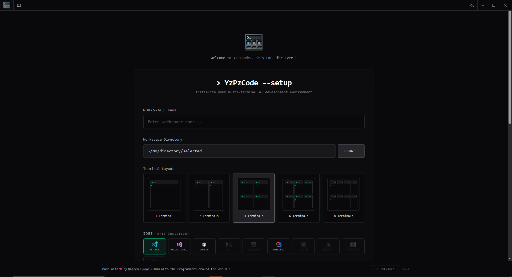
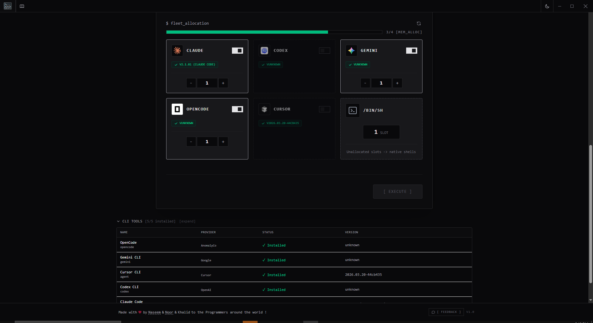
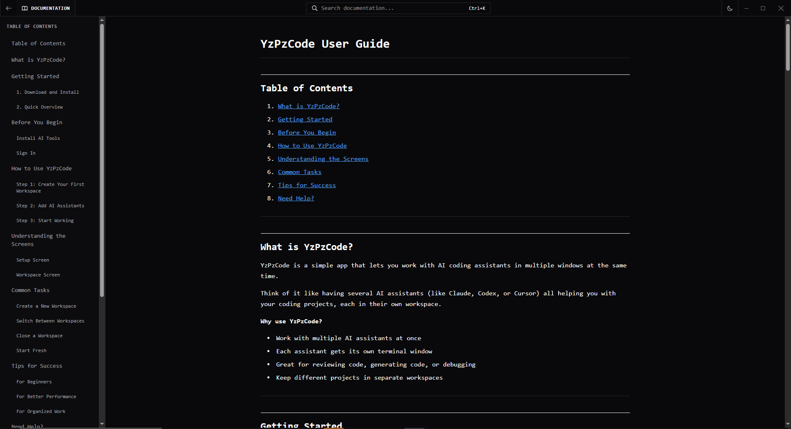
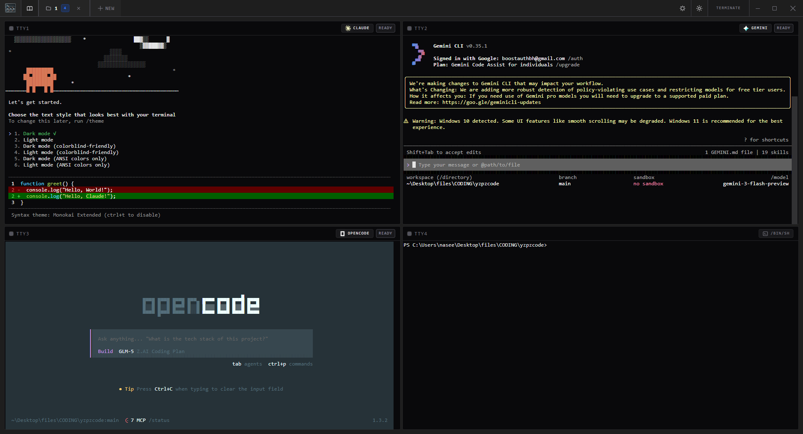
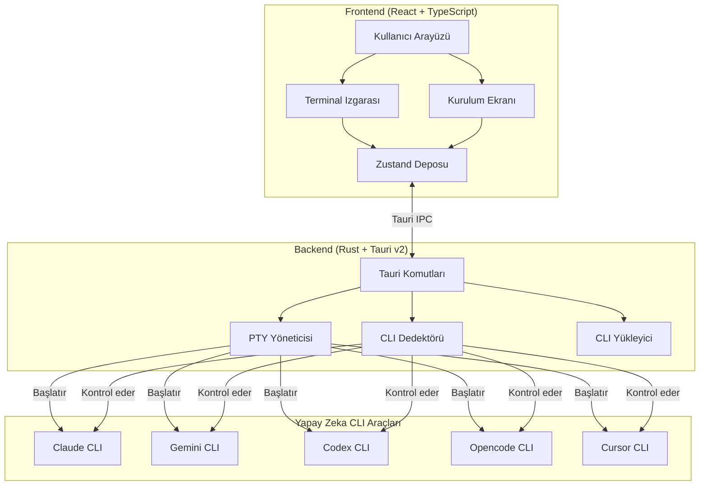
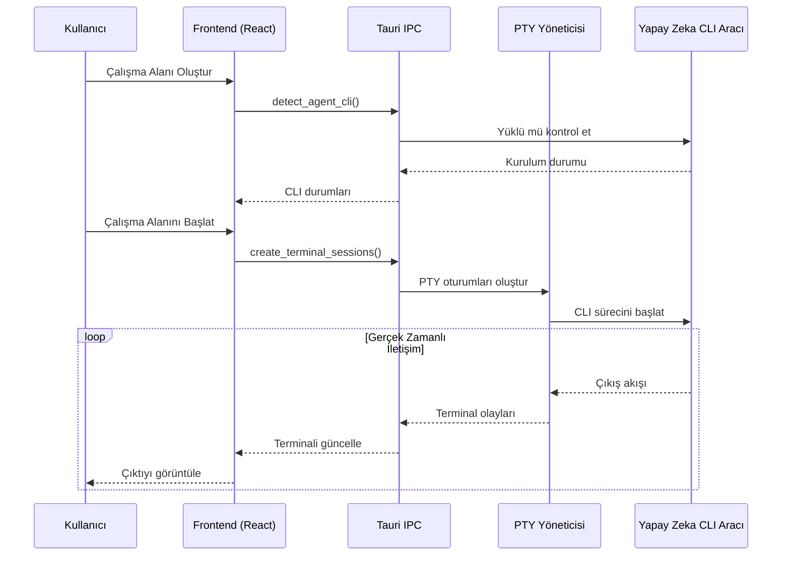

<div align="center">


# YzPzCode

### Yapay Zeka Kodlama Ekibiniz, Tek Pencere Uzağınızda.

**5 farklı terminal arasında zıplamayı bırakın.** YzPzCode, Claude, Gemini, Codex, Opencode ve Cursor'u tek temiz bir arayüzde bir araya getirir.

[](https://github.com/wolfenazz/YzPzCode/stargazers)
[](https://tauri.app)
[](https://react.dev)
[](https://rust-lang.org)
[](LICENSE)

**[Şimdi Yükle](#-hızlı-başlangıç)** · **[Ekran Görüntülerini Gör](#-uygulamayı-aksiyonda-gör)** · **[Dokümantasyonu Oku](docs/userguid.md)**

---

</div>

## Durun, Bu Ne?

Bunu hayal edin: Kod yazıyorsunuz. Claude'dan eski bir kodu açıklamasını, Gemini'den testler üretmesini ve Codex'den o zorlu algoritma konusunda yardım istiyorsunuz.

**Eski yöntem mi?** Üç terminal penceresi. Üç farklı CLI. Bir deli gibi alt-sekme yapma. Aralarında kopyala-yapıştır. Aklınızı kaybetme.

**YzPzCode yöntemi mi?** Tek uygulama. Izgara düzeni. Tüm yapay zeka ajanları yan yana, yanıtlarını karşılaştırabilirsiniz.

## Uygulamayı Aksiyonda Gör

<div align="center">






*Evet, bu kadar temiz.*

</div>

## Neden Seveceksiniz

| Ne Alacaksınız | Neden Harika |
|----------------|--------------|
| **Çoklu Ajan Izgarası** | Claude solda, Gemini sağda. Çıktıları anında karşılaştırın. Kazananı seçin. |
| **Tek Tıklamalı Kurulum** | Ne yüklü olduğunu bilmiyor musunuz? Bulacağız ve gerisini size rehberlik edeceğiz. |
| **Çalışma Alanı Ön Ayarları** | Favori ajan kombinasyonlarınızı kaydedin. Claude + Gemini ile 3x2 ızgara? Tek tıklama. |
| **Gerçek Terminaller** | Bir simülasyon değil — tam etkileşimli gerçek PTY oturumları. |
| **Çapraz Platform** | Windows, macOS, Linux. İşletim sisteminiz, seçiminiz. |
| **Hafif** | Electron değil, Tauri ile yapıldı. RAM'iniz size teşekkür edecek. |

## Ajanlar

Ağır sıkletleri destekliyoruz:

<div align="center">

| Ajan | CLI | Süper Güç |
|------|-----|-----------|
| **Claude** | `claude` | Derin muhakeme, sabırlı bir kıdemli geliştirici gibi kod açıklar |
| **Gemini** | `gemini` | Hızlı, çok modlu, Google'ın en iyisi |
| **Codex** | `codex` | Gerçekten işe yarayan kod üretimi |
| **Opencode** | `opencode` | Açık kaynak özgürlüğü |
| **Cursor** | `cursor` | IDE seviyesinde yapay zeka desteği |

</div>

## Hızlı Başlangıç

**İhtiyacınız olan:** Node.js 18+ ve Rust (en son kararlı sürüm)

```bash
# 1. Klonlayın
git clone https://github.com/wolfenazz/YzPzCode.git
cd YzPzCode/app

# 2. Bağımlılıkları yükleyin
npm install

# 3. Çalıştırın
npm run tauri dev
```

Hepsi bu. Uygulama, hangi yapay zeka CLI'larının yüklü olduğunu tespit edecek ve kalanları kurmanıza yardımcı olacak.

### macOS Kullanıcıları

**Önce Rust'ı yükleyin:**
```bash
curl --proto '=https' --tlsv1.2 -sSf https://sh.rustup.rs | sh
```
Ardından `npm run tauri dev` çalıştırmadan önce terminalinizi yeniden başlatın.

**.dmg'den mi yüklüyorsunuz?** Uygulama bir Apple Geliştirici sertifikası ile kod imzalı olmadığı için bir güvenlik uyarısı göreceksiniz. Bunu atlamak için:

**1. Seçenek: Sağ tıkla aç**
1. Uygulamaya sağ tıklayın (veya Control-tıklayın)
2. "Aç"ı seçin → İletişim kutusunda "Aç"a tıklayın

**2. Seçenek: Sistem Ayarları**
1. **Sistem Ayarları → Gizlilik ve Güvenlik** bölümüne gidin
2. Güvenlik uyarısının yanındaki "Yine de Aç"a tıklayın

**3. Seçenek: Terminal**
```bash
xattr -cr /Applications/YzPzCode.app
```

Uygulama güvenli — bu açık kaynaklı depodan oluşturulmuştur. Uyarı, macOS'un sizi imzalanmamış uygulamalardan korumasıdır.

> **Not:** Uygulamayı bir Apple Geliştirici sertifikası ile düzgün şekilde kod imzalamak için çalışıyoruz. Bu süreç birkaç hafta sürer, ancak tamamlandığında güvenlik uyarısı artık görünmeyecektir.

<details>
<summary>Daha fazla detaya mı ihtiyacınız var?</summary>

### Ön Koşullar

- **Node.js** (v18+) — [Buradan indirin](https://nodejs.org)
- **Rust** (en son kararlı sürüm) — [Buradan edinin](https://rust-lang.org)
- **pnpm** veya npm — hangisini tercih ederseniz

### Üretim İçin Derleme

```bash
npm run tauri build
```

Bu, platformunuz için yerel bir yükleyici oluşturur. Küçük, hızlı, gereksiz şişkinlik yok.

</details>

## Nasıl Yapıldı

Kötü olmayan araçları seçtik:

**Frontend**
- React 19 + TypeScript
- Vite (çünkü derleme beklemek çok 2020)
- Tailwind CSS v4
- Zustand (mantıklı durum yönetimi)
- xterm.js (terminal oluşturma)

**Backend**
- Tauri v2 (Rust destekli, hafif)
- portable-pty (gerçek pseudo-terminaller)
- Tokio (ölçeklenen async)

### Mimari



### Veri Akışı



## Meraklılar İçin

```
app/
├── src-tauri/          # Rust backend
│   └── src/
│       ├── agent/      # Ajan düzenleme
│       ├── agent_cli/  # CLI algılama ve kurulum
│       ├── commands/   # Tauri IPC işleyicileri
│       └── terminal/   # PTY yönetimi
├── src/                # React frontend
│   ├── components/     # UI bileşenleri
│   ├── hooks/          # Özel hook'lar
│   ├── stores/         # Zustand depoları
│   └── types/          # TypeScript tanımları
└── docs/               # Dokümantasyon
```

## Katkıda Bulunma

Yardımınızı seviyoruz! Geliştirme sırasında aklınızı korumanın yolu:

```bash
# Tip kontrolü
npx tsc --noEmit        # Frontend
cargo check             # Backend

# Linting ve formatlama
cargo clippy            # Rust sorunlarını yakala
cargo fmt               # Güzel hale getir

# Testler
cd src-tauri && cargo test
```

Bir hata mı buldunuz? Bir fikriniz mi var? [Bir sorun açın](https://github.com/wolfenazz/YzPzCode/issues) veya [bir PR gönderin](https://github.com/wolfenazz/YzPzCode/pulls).

[Tam yol haritasına](docs/plane.md) göz atın.

## Önerilen Kurulum

- [VS Code](https://code.visualstudio.com)
- [Tauri Eklentisi](https://marketplace.visualstudio.com/items?itemName=tauri-apps.tauri-vscode)
- [rust-analyzer](https://marketplace.visualstudio.com/items?itemName=rust-lang.rust-analyzer)

Veya sizi verimli kılan herhangi bir şeyi kullanın. Yargılamak için değiliz.

## Lisans

MIT. Çatallaştır, üzerine inşa et, senin olsun. Sadece nereden aldığını hatırla.

---

<div align="center">

### Beğendiniz mi?

YzPzCode sizi terminal kaosundan kurtardıysa, ona bir **yıldız** vermeyi düşünün — başkalarının da bulmasına yardımcı olur!

[](https://github.com/wolfenazz/YzPzCode/stargazers)

---

**[Naseem](https://github.com/wolfenazz), Noor & Khalid tarafından kafein ve geç gecelerle yapıldı**

*Terimalleri yönetmek yerine kod yazmayı tercih eden geliştiriciler için.*

[Hata Bildir](https://github.com/wolfenazz/YzPzCode/issues) · [Özellik İste](https://github.com/wolfenazz/YzPzCode/issues) · [Katkıda Bulun](https://github.com/wolfenazz/YzPzCode/pulls)

</div>
